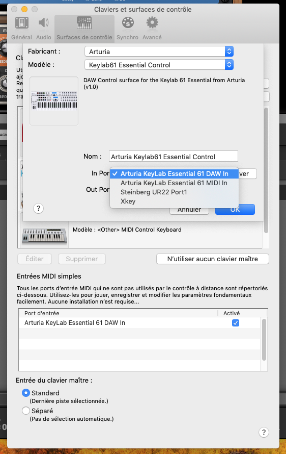

# Reason-ArturiaKeylabEssential-Remote

Remote is the Propellerheadʼs protocol for communication between hardware control surfaces and Reason Studio application. This project provides Reason remote scripts for the **DAW Command Center** surface of the Arturia Keylab Essential keyboard

**Note**: I am not affiliated or associated in any way with Arturia or Propellerhead. I have created these files myself with the files and programs legally available to me.

:warning: **WARNING**: You download and use these files entirely at your own risk!


## Installation

### Install the scripts

To install the Remote scripts in your environement, the files in the `Remote` directory should be copied to your Propellerhead installation directory:

* On MacOS

```bash
Macintosh HD/Library/Application Support/Propellerhead Software/Remote
```

* On Window 7 and above

```bash
C:/ProgramData/Propellerhead Software/Remote
```

### Setup the Arturia DAW Command Center as the control surface in Reason

* Open the Preferences dialog and click the Control Surfaces tab.


* To add manually the control surface, click the “Add manually” button. This brings up a new dialog.
* Select "Arturia Keylab 61 Essential Control" from the Model pop-up menu. Select `Arturia KeyLab 61 Essential DAW In` for `In Port` attribut and `Arturia Keylab Essential DAW Out` for `Out Port` attribut.



## Mapping between Arturia control surfaces and Reason

### Mapping between the Aturia DAW Command Center and Reason


Mapping of the different buttons

| Arturia DAW Command Center | Reason Command | Comment |
| -------------------------- | -------------- | ----------------------- |
| Stop | Stop | Stops playback. Pressing two time will return the playback cursor to the start of the track. |
| Pause/play | Play | Starts and pauses your track at the current position of the playback cursor. In pause mode, the stop button LED is on and the pause/play button LED is slightly on |
| Record | Record On/off | Arms the record function in Reason. Hitting the Record button while the track is stopped will begin playback while recording. If the track is already playing, hitting Record will begin recording from the current playback cursor position. |
| Loop | Loop On/off | Toggles the Loop function on and off. The loop region is set within Reason. |
| Rewind | Rewind | Quickly moves the playback cursor backward. |
| Fast forward | Fast Forward | Quickly moves the playback cursor forward. |
| Save | Redo |  Redo your last undo action. If there is no action to redo, the button's led is off |
| Undo | Undo  | Reverses your last action. If there is no action, the button's led is off |
| Punch | Precount On/Off | Toggles Reason’s metronome precount on and off. |
| Metro | Click On/Off | Toggles Reason’s metronome on and off. |

### Mapping with Reason when using the Arturia keyboard DAW map

| Arturia Keyboard surface | Reason Command | Comment |
| -------------------------- | -------------- | ----------------------- |
| Jog wheel | Loop locators | jog wheel is used to change the position of left&right loop locators (press the jog wheel to change the active loop locator) |
| Left Arrow | Tempo | Left & Right arrows buttons arround the jog wheel are use to change the tempo |
| Right Arrow | Tempo | Left & Right arrows buttons arround the jog wheel are use to change the tempo |
| Master fader| Master Section level | Change the Master Section level (This control surface need to be locked to the Master Section to work properlly |

### Mapping with the Combinator

| Arturia Keyboard surface | Reason Command | Comment |
| -------------------------- | -------------- | ----------------------- |
| Encoder 1 | Rotary 1 |  |
| Encoder 2 | Rotary 2 |  |
| Encoder 3 | Rotary 3 |  |
| Encoder 4 | Rotary 4 |  |
| Jog Wheel | Patch Selection | The 1 line of the Arturia Keyboad LCD should display "Combinator" and the second one the name of the selected patch |

### Mapping with the Mixer 14:2

| Arturia Keyboard surface | Reason Command | Comment |
| -------------------------- | -------------- | ----------------------- |
| Master volume | Master level|  |
| Master pan | Aux 1 Return Level |  |
| Fader <1-8> | Channel <1-8> Level |  |
| Encoder <1-8> | Channel <1-8> Pan |  |
| Fader <1-6> | Channel <9-14> Level | The 1 line of the Arturia Keyboad LCD should display "Mixer 14:2" and the second one "Ch1-8" for channels 1 to 8 actives |
| Encoder <1-6> | Channel <9-14> Pan | The 1 line of the Arturia Keyboad LCD should display "Mixer 14:2" and the second one "Ch9-14" for channels 9 to 14 actives  |
| Part1 / Next| Keyboard Shortcut Variations | Channels 9 to 14 actives |
| Part2 / Prev| Keyboard Shortcut Variations | Channels 1 to 8 actives |

### Mapping with the Line Mixer 6:2

| Arturia Keyboard surface | Reason Command | Comment |
| -------------------------- | -------------- | ----------------------- |
| Master volume | Master level|  |
| Master pan | Aux Return Level |  |
| Fader <1-6> | Channel <1-6> Level | The 1 line of the Arturia Keyboad LCD should display "Line Mixer 6:2" and the second one "Level&Pan" |
| Encoder <1-6> | Channel <1-6> Pan | The 1 line of the Arturia Keyboad LCD should display "Line Mixer 6:2" and the second one "Level&Pan" |
| Encoder <1-6> | Channel <1-6> Aux Send | The 1 line of the Arturia Keyboad LCD should display "Line Mixer 6:2" and the second one "Aux" |
| Part1 / Next| Keyboard Shortcut Variations | "Aux" group selected |
| Part2 / Prev| Keyboard Shortcut Variations | "Level&Pan" group selected |

### Mapping with the ID8 instrument device

The first line of the Arturia Keyboad LCD should display "ID8" and the second one the preset name.

| Arturia Keyboard surface | Reason Command | Comment |
| -------------------------- | -------------- | ----------------------- |
| Master volume | Volume |  |
| Fader 1 | Parameter 1 |  |
| Fader 2 | Parameter 2 |  |
| Jog-wheel | Select Previous/Next Category | when "Cat/Char" is selected |
| Jog-wheel | Select Previous/Next Sound | when "Preset" is selected |
| Left arrow | Select Previous Preset |  |
| Right arrow | Select Next Preset |  |

### Mapping with the SubTractor instrument device

The first line of the Arturia Keyboad LCD should display "SubTractor" and the second one the preset name.

| Arturia Keyboard surface | Reason Command | Comment |
| -------------------------- | -------------- | ----------------------- |
| Master volume | Volume |  |
| Fader 1 | Filter Env Attack |  |
| Fader 2 | Filter Env Decay |  |
| Fader 3 | Filter Env Sustain |  |
| Fader 4 | Filter Env Release |  |
| Fader 5 | Amp Env Attack |  |
| Fader 6 | Amp Env Decay |  |
| Fader 7 | Amp Env Sustain |  |
| Fader 8 | Amp Env Release |  |
| Encoder 1 | Osc1 Phase Diff |  |
| Encoder 2 | Osc2 Phase Diff |  |
| Encoder 3 | Osc1 Wave |  |
| Encoder 4 | Osc2 Wave |  |
| Encoder 5 | Filter Freq |  |
| Encoder 6 | Filter Res |  |
| Encoder 7 | Filter2 Freq |  |
| Encoder 8 | Filter2 Res |  |
| Jog-wheel | Select Previous/Next Preset | when "Preset" is selected |

### Mapping with the Thor instrument device

The first line of the Arturia Keyboad LCD should display "Thor" and the second one the preset name.

| Arturia Keyboard surface | Reason Command | Comment |
| -------------------------- | -------------- | ----------------------- |
| Master volume | Volume |  |
| Fader 1 | Filter Env Attack |  |
| Fader 2 | Filter Env Decay |  |
| Fader 3 | Filter Env Sustain |  |
| Fader 4 | Filter Env Release |  |
| Fader 5 | Amp Env Attack |  |
| Fader 6 | Amp Env Decay |  |
| Fader 7 | Amp Env Sustain |  |
| Fader 8 | Amp Env Release |  |
| Encoder 1 | Filter 1 Freq |  |
| Encoder 2 | Filter 1 Res |  |
| Encoder 3 | Filter 2 Freq |  |
| Encoder 4 | Filter 2 Res |  |
| Encoder 5 | Filter 3 Freq |  |
| Encoder 6 | Filter 3 Res |  |
| Encoder 7 | Rotary 1 |  |
| Encoder 8 | Rotary 2 |  |
| Jog-wheel | Select Previous/Next Preset | when "Preset" is selected |

### Mapping with the Malstrom instrument device

The first line of the Arturia Keyboad LCD should display "Malstrom" and the second one the preset name.

| Arturia Keyboard surface | Reason Command | Comment |
| -------------------------- | -------------- | ----------------------- |
| Master volume | Volume |  |
| Fader 1 | Filter Env Attack |  |
| Fader 2 | Filter Env Decay |  |
| Fader 3 | Filter Env Sustain |  |
| Fader 4 | Filter Env Release |  |
| Fader 5 | Oscillator A Attack |  |
| Fader 6 | Oscillator A Decay |  |
| Fader 7 | Oscillator A Sustain |  |
| Fader 8 | Oscillator A Release |  |
| Encoder 1 | Filter A Freq |  |
| Encoder 2 | Filter A Res |  |
| Encoder 3 | Filter B Freq |  |
| Encoder 4 | Filter B Res |  |
| Encoder 5 | Modulator A Rate |  |
| Encoder 6 | Modulator B Rate |  |
| Encoder 7 | Oscillator A Motion |  |
| Encoder 8 | Oscillator B Motion |  |
| Jog-wheel | Select Previous/Next Preset | when "Preset" is selected |

### Mapping with the NN19 Digital Sampler

The first line of the Arturia Keyboad LCD should display "NN19" and the second one the preset name.

| Arturia Keyboard surface | Reason Command | Comment |
| -------------------------- | -------------- | ----------------------- |
| Master volume | Volume |  |
| Fader 1 | Filter Env Attack |  |
| Fader 2 | Filter Env Decay |  |
| Fader 3 | Filter Env Sustain |  |
| Fader 4 | Filter Env Release |  |
| Fader 5 | Amp Env Attack |  |
| Fader 6 | Amp Env Decay |  |
| Fader 7 | Amp Env Sustain |  |
| Fader 8 | Amp Env Release |  |
| Encoder 1 | Filter Freq |  |
| Encoder 2 | Filter Res |  |
| Encoder 3 | LFO Rate |  |
| Encoder 4 | LFO Amount |  |
| Encoder 5 | Filter Kbd Track |  |
| Encoder 6 | Filter Env Amount |  |
| Encoder 7 | Osc Octave |  |
| Encoder 8 | Osc Semitone |  |
| Jog-wheel | Select Previous/Next Preset | when "Preset" is selected |

### Mapping with the NN-XT Advanced Sampler

The first line of the Arturia Keyboad LCD should display "NN-XT" and the second one the preset name.

| Arturia Keyboard surface | Reason Command | Comment |
| -------------------------- | -------------- | ----------------------- |
| Master volume | Volume |  |
| Master pan | External Controler |  |
| Encoder 1 | Filter Freq |  |
| Encoder 2 | Filter Res |  |
| Encoder 3 | Amp Env Attack |  |
| Encoder 4 | Amp Env Decay |  |
| Encoder 5 | Amp Env Release|  |
| Encoder 6 | Mod env Decay |  |
| Jog-wheel | Select Previous/Next Preset | when "Preset" is selected |

### Mapping with the Dr. Octo REX

The first line of the Arturia Keyboad LCD should display "Dr. Octo REX" and the second one the preset name.

| Arturia Keyboard surface | Reason Command | Comment |
| -------------------------- | -------------- | ----------------------- |
| Master volume | Volume |  |
| Master pan | Transpose |  |
| Fader 1 | Filter Env Attack |  |
| Fader 2 | Filter Env Decay |  |
| Fader 3 | Filter Env Sustain |  |
| Fader 4 | Filter Env Release |  |
| Fader 5 | Amp Env Attack |  |
| Fader 6 | Amp Env Decay |  |
| Fader 7 | Amp Env Sustain |  |
| Fader 8 | Amp Env Release |  |
| Encoder 1 | Filter Freq |  |
| Encoder 2 | Filter Res |  |
| Encoder 3 | Filter Env Amount |  |
| Encoder 4 | LFO1 Rate|  |
| Encoder 5 | LFO1 Amount|  |
| Encoder 6 | Filter Mode |  |
| Encoder 7 | LFO1 Wave |  |
| Encoder 8 | LFO1 Dest |  |
| Jog-wheel | Select Previous/Next Preset | when "Preset" is selected |

### Mapping with the Redrum Drum Computer

The first line of the Arturia Keyboad LCD should display "Redrum" and "Ch1-8" or "Ch9-10" depending which variation is active. The second line display the preset name.

| Arturia Keyboard surface | Reason Command | Comment |
| -------------------------- | -------------- | ----------------------- |
| Master volume | Master level|  |
| Fader <1-8> | Drum <1-8> Level | When "Ch1-8" variation is active |
| Encoder <1-8> | Drum <1-8> Pan | When "Ch1-8" variation is active |
| Fader <1-2> | Drum <9-10> Level | When "Ch9-10" vartiona is active |
| Encoder <1-2> | Drum <9-10> Pan | When "Ch9-10" variation is active |
| Part1 / Next| Keyboard Shortcut Variations | To select Channels 9 to 10 variation |
| Part2 / Prev| Keyboard Shortcut Variations | To select Channels 1 to 8 varation |

### Mapping with the Kong Drum Designer

The first line of the Arturia Keyboad LCD should display "Kong" and "Ch1-8" or "Ch9-16" depending which variation is active. The second line display the preset name.

| Arturia Keyboard surface | Reason Command | Comment |
| -------------------------- | -------------- | ----------------------- |
| Master volume | Master level|  |
| Fader <1-8> | Drum <1-8> Level | When "Ch1-8" variation is active |
| Encoder <1-8> | Drum <1-8> Pan | When "Ch1-8" variation is active |
| Fader <1-8> | Drum <9-16> Level | When "Ch9-16" vartiona is active |
| Encoder <1-8> | Drum <9-16> Pan | When "Ch9-16" variation is active |
| Part1 / Next| Keyboard Shortcut Variations | To select Channels 9 to 16 variation |
| Part2 / Prev| Keyboard Shortcut Variations | To select Channels 1 to 8 varation |

## Ressources on Remote

* [Korg Nano Kontrol](https://github.com/carlosedp/Reason-KorgNanoKontrol2-Remote) by <carlosedp@gmail.com>
* [Propellerhead Control Remote Tutorial](https://www.reasonstudios.com/blog/control-remote)
* [Reason Remoter](http://www.reasonremoter.uk/)
* [Hacking Remote Files in Reason](https://www.soundonsound.com/techniques/hacking-remote-files-reason)

## Other links

* [Markdown guide](https://guides.github.com/pdfs/markdown-cheatsheet-online.pdf)
* [LUA 5.0 documentation](http://www.lua.org/manual/5.0/.)
* [LUA Script tutorial](https://wxlua.developpez.com/tutoriels/lua/general/cours-complet/)
* [Midi reference tables](https://www.midi.org/specifications-old/category/reference-tables)
* [Arturia Keylab Essential](https://www.arturia.com/support/keylab-essential-start)

## History

* [Changelog](./CHANGELOG.md)

## Know bugs

* When Preset is selected, jog-wheel didn't change the preset selection (on ID8, Combinator)
  * Workaround on Combinator has been to use `Select Patch Delta` remotable item and jog-wheel as delta control for now.
* Part1/Part2/Live buttons didn't select group variations on map file
  * workarround has been to use Keyboard Shortcut Variations for now.
