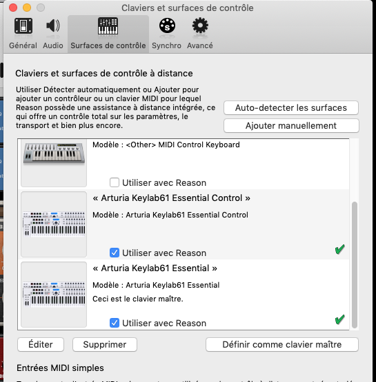

# Reason-ArturiaKeylabEssential-Remote

Remote is the Propellerheadʼs protocol for communication between hardware control surfaces and Reason Studio application. This project provides Reason remote scripts for the **DAW Command Center** surface of the Arturia Keylab Essential keyboard and the **keyboard** itself (pads, encoders and faders sections).


## Installation

### :one: Install the scripts

To install the Remote scripts in your environement, the files in the `Remote` directory should be copied to your Propellerhead installation directory:

* On MacOS

```bash
Macintosh HD/Library/Application Support/Propellerhead Software/Remote
```

* On Window 7 and above

```bash
C:/ProgramData/Propellerhead Software/Remote
```

### :two: Setup the Arturia Keylab61 Essential DAW Command Center as a control surface in Reason

* Open the Preferences dialog and click the Control Surfaces tab.


* To add manually the control surface, click the “Add manually” button. This brings up a new dialog.
* Select "Arturia Keylab 61 Essential Control" from the Model pop-up menu. Select `Arturia KeyLab 61 Essential DAW In` for `In Port` attribut and `Arturia Keylab Essential DAW Out` for `Out Port` attribut.


### :three: Setup the Arturia Keylab61 Essential keyboard as a control surface in Reason

* Open the Preferences dialog and click the Control Surfaces tab.
* To add manually the control surface, click the “Add manually” button. This brings up a new dialog.
* Select "Arturia Keylab 61 Essential" from the Model pop-up menu. Select `Arturia KeyLab 61 Essential MIDI In` for `In Port` attribut and `Arturia Keylab Essential MIDI Out` for `Out Port` attribut.
* optional: select `Arturia KeyLab 61 Essential` as the master keyboard


:exclamation: At that point youd should have 2 new control surfaces:

* `Arturia KeyLab 61 Essential Control` map to Arturia DAW Midi in & out ports
* `Arturia KeyLab 61 Essential` map to Arturia Midi in & out ports and defined as master keyboard



### :four: Set Keyboard Shortcut Variations

To change which keyboard shortcut variation is selected in Reason using the Arturia keyboard, map Previous/Next keyboard shortcut variation to `Arturia KeyLab 61 Essential` - `part2-prev/part1-next`


See [Reason doc](http://docs.propellerheads.se/reason10/wwhelp/wwhimpl/js/html/wwhelp.htm#context=EngOpManProjectPro&topic=PreferencesControlSurface) for more information

## Mapping between Arturia control surfaces and Reason

* [DAW commands & Master Section mapping](./mapping-doc/daw-mapping.md)
* [Instruments mapping](./mapping-doc/instruments-mapping.md)
* [Effects mapping](./mapping-doc/effects-mapping.md)
* [Utilities mapping](./mapping-doc/utilities-mapping.md)
* [Players mapping](./mapping-doc/players-mapping.md)

## Ressources on Remote

* [Propellerhead Control Remote Tutorial](https://www.reasonstudios.com/blog/control-remote)
* [Reason Remoter](http://www.reasonremoter.uk/)
* [Hacking Remote Files in Reason](https://www.soundonsound.com/techniques/hacking-remote-files-reason)
* [Collection of Remote Templates for Propellerhead's Reason Rack Extensions](https://github.com/LividInstruments/Reason_RE_Remote_Templates)

## Other links

* [Markdown guide](https://guides.github.com/pdfs/markdown-cheatsheet-online.pdf)
* [LUA 5.0 documentation](http://www.lua.org/manual/5.0/.)
* [LUA Script tutorial](https://wxlua.developpez.com/tutoriels/lua/general/cours-complet/)
* [Midi reference tables](https://www.midi.org/specifications-old/category/reference-tables)
* [Arturia Keylab Essential](https://www.arturia.com/support/keylab-essential-start)

## History

* [Changelog](./CHANGELOG.md)

## Know bugs

* When Preset is selected, jog-wheel didn't change the preset selection (on ID8, Combinator)
  * Workaround on Combinator has been to use `Select Patch Delta` remotable item and jog-wheel as delta control for now.
* Part1/Part2/Live buttons didn't select group variations on map file
  * workaround has been to use Keyboard Shortcut Variations for now.
