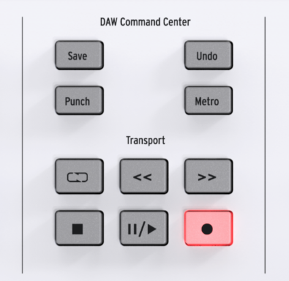
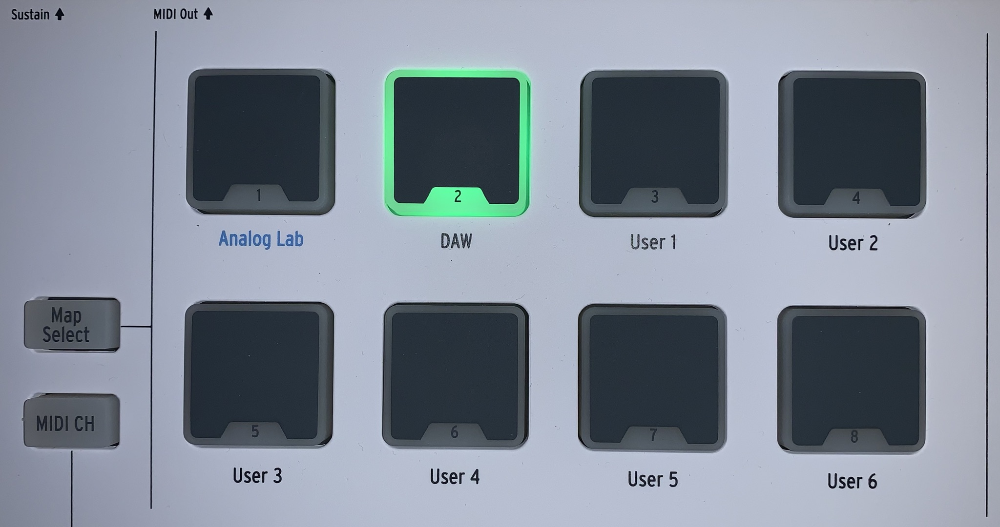

# Mapping between the Aturia DAW Command Center and Reason

| Arturia DAW Command Center | Reason Command | Comment |
| -------------------------- | -------------- | ----------------------- |
| Stop | Stop | Stops playback. Pressing two time will return the playback cursor to the start of the track. |
| Pause/play | Play | Starts and pauses your track at the current position of the playback cursor. In pause mode, the stop button LED is on and the pause/play button LED is slightly on |
| Record | Record On/off | Arms the record function in Reason. Hitting the Record button while the track is stopped will begin playback while recording. If the track is already playing, hitting Record will begin recording from the current playback cursor position. |
| Loop | Loop On/off | Toggles the Loop function on and off. The loop region is set within Reason. |
| Rewind | Rewind | Quickly moves the playback cursor backward. |
| Fast forward | Fast Forward | Quickly moves the playback cursor forward. |
| Save | Redo |  Redo your last undo action. If there is no action to redo, the button's led is off |
| Undo | Undo  | Reverses your last action. If there is no action, the button's led is off |
| Punch | Precount On/Off | Toggles Reason’s metronome precount on and off. |
| Metro | Click On/Off | Toggles Reason’s metronome on and off. |

## Mapping with Reason when using the Arturia keyboard DAW map

:warning: To activate DAW map on Arturia keyboard, press `Map Select` then press `pad#2`. The pad #2 lights up in green.

:bulb: When the `Map Select` button is pressed on the Arturia keyboard, the active pad will light up to show the Map currently in use.

The first line of the Arturia Keyboad LCD should display "Master (base ch)" and the second the name of the remote base channel selected.

| Arturia Keyboard surface | Reason Command | Comment |
| -------------------------- | -------------- | ----------------------- |
| Jog wheel | Loop locators | jog wheel is used to change the position of left&right loop locators (press the jog wheel to change the active loop locator) |
| Left Arrow | Tempo | Left & Right arrows buttons arround the jog wheel are use to change the tempo |
| Right Arrow | Tempo | Left & Right arrows buttons arround the jog wheel are use to change the tempo |
| Master fader| Master Section level | Change the Master Section level |
| Encoder <1-8> | Channel <1-8> Pan | The group of 8 channels controlled are function of the base channel selected |
| Fader <1-8> | Channel <1-8> Level | The group of 8 channels controlled are function of the base channel selected |
| Part 1 | Next 8 Remote Base Channel | To select the next 8 remote channels that will be controlled at a given time |
| Part 2 | Previous 8 Remote Base Channel | To select the previous 8 remote channels that will be controlled at a given time |

:warning: the `Arturia KeyLab 61 Essential Control` surface need to be locked to the Reason Master Section to work properlly
