# Effects mapping

* [Alligator](#mapping-with-the-alligator)
* [Echo](#mapping-with-the-echo)
* [Pulveriser](#mapping-with-the-pulveriser)
* [Softube BassAmp](#mapping-with-the-softube-bassamp)
* [Softube Amp](#mapping-with-the-softube-amp)
* [Synchronous Timed Effect Modulator](#mapping-with-the-synchronous-timed-effect-modulator)
* [Audiomatic Retro Transformer](#mapping-with-the-audiomatic-retro-transformer)
* [Scream 4 Sound Destruction Unit](#mapping-with-the-scream-4-sound-destruction-unit)
* [BV512 Vocoder](#mapping-with-the-bv512-vocoder)
* [Neptune Pitch Adjuster and Voice Synth](#mapping-with-the-neptune-pitch-adjuster-and-voice-synth)
* [Reverb RV7000 Mk II Advanced Reverb](#mapping-with-the-reverb-rv7000-mk-ii-advanced-reverb)
* [MClass Equalizer](#mapping-with-the-mclass-equalizer)
* [MClass Compressor](#mapping-with-the-mclass-compressor)
* [MClass Maximizer](#mapping-with-the-mclass-maximizer)
* [MClass Stereo Imager](#mapping-with-the-mclass-stereo-imager)
* [RV-7 Digital Reverb](#mapping-with-the-rv-7-digital-reverb)
* [DDL-1 Digital Delay Line](#mapping-with-the-ddl-1-digital-delay-line)
* [D-11 Foldback Distortion](#mapping-with-the-d-11-foldback-distortion)
* [ECF-42 Envelope Controlled Filter](#mapping-with-the-ecf-42-envelope-controlled-filter)
* [CF-101 Chorus/Flanger](#mapping-with-the-cf-101-chorusflanger)
* [PH-90 Phaser](#mapping-with-the-ph-90-phaser)
* [UN-16 Unison](#mapping-with-the-un-16-unison)
* [COMP-01 Auto Make-up Gain Compressor](#mapping-with-the-comp-01-auto-make-up-gain-compressor)
* [PEQ-2 Two Band Parametric EQ](#mapping-with-the-peq-2-two-band-parametric-eq)
* [MagmaSonic Classic Filter](#mapping-with-the-magmasonic-classic-filter)
* [Softube Saturation Knob](#mapping-with-the-softube-saturation-knob)
* [Quartet Chorus Ensemble](#mapping-with-the-quartet-chorus-ensemble)
* [Sweeper Modulation Effect](#mapping-with-the-sweeper-modulation-effect)
* [Master Bus Compressor](#mapping-with-the-master-bus-compressor)
* [Channel Dynamics Compressor & Gate](#mapping-with-the-channel-dynamics-compressor-and-gate)
* [Channel EQ Equalizer](#mapping-with-the-channel-eq-equalizer)

## Mapping with the Alligator

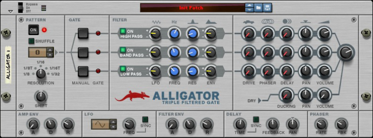

The first line of the Arturia Keyboad LCD should display "Alligator" and the second one, the name of the selected patch or the active filter depending which variation is active.

| Arturia Keyboard surface | Reason Command | Comment |
| -------------------------- | -------------- | ----------------------- |
| Master Fader | Master level |  |
| Fader 1 | Amp Env Attack | When main variation is active |
| Fader 2 | Amp Env Decay | When main variation is active |
| Fader 3 | Amp Env Release | When main variation is active |
| Fader 5 | Filter Env Attack | When main variation is active |
| Fader 6 | Filter Env Decay | When main variation is active |
| Fader 7 | Filter Env Release | When main variation is active |
| Encoder 1 | High Pass LFO Amount | When "High Pass filter" variation is active |
| Encoder 2 | High Pass Frequency | When "High Pass filter" variation is active |
| Encoder 3 | High Pass Resonance | When "High Pass filter" variation is active |
| Encoder 4 | High Pass Env Amount | When "High Pass filter" variation is active |
| Encoder 5 | High Pass Drive Amount | When "High Pass filter" variation is active |
| Encoder 6 | High Pass Phaser Amount | When "High Pass filter" variation is active |
| Encoder 7 | High Pass Delay Amount | When "High Pass filter" variation is active |
| Encoder 8 | High Pass Pan | When "High Pass filter" variation is active |
| Master Pan | High Pass Volume | When "High Pass filter" variation is active |
| Encoder 1 | Band Pass LFO Amount | When "Band Pass filter" variation is active |
| Encoder 2 | Band Pass Frequency | When "Band Pass filter" variation is active |
| Encoder 3 | Band Pass Resonance | When "Band Pass filter" variation is active |
| Encoder 4 | Band Pass Env Amount | When "Band Pass filter" variation is active |
| Encoder 5 | Band Pass Drive Amount | When "Band Pass filter" variation is active |
| Encoder 6 | Band Pass Phaser Amount | When "Band Pass filter" variation is active |
| Encoder 7 | Band Pass Delay Amount | When "Band Pass filter" variation is active |
| Encoder 8 | Band Pass Pan | When "Band Pass filter" variation is active |
| Master Pan | Band Pass Volume | When "Band Pass filter" variation is active |
| Encoder 1 | Low Pass LFO Amount | When "Low Pass filter" variation is active |
| Encoder 2 | Low Pass Frequency | When "Low Pass filter" variation is active |
| Encoder 3 | Low Pass Resonance | When "Low Pass filter" variation is active |
| Encoder 4 | Low Pass Env Amount | When "Low Pass filter" variation is active |
| Encoder 5 | Low Pass Drive Amount | When "Low Pass filter" variation is active |
| Encoder 6 | Low Pass Phaser Amount | When "Low Pass filter" variation is active |
| Encoder 7 | Low Pass Delay Amount | When "Low Pass filter" variation is active |
| Encoder 8 | Low Pass Pan | When "Low Pass filter" variation is active |
| Master Pan | Low Pass Volume | When "Low Pass filter" variation is active |
| Part1 / Next| Keyboard Shortcut Variations | To switch between "main", "High Pass Filter", "Band Pass Filter" & "Low Pass Filter" variations |
| Part2 / Prev| Keyboard Shortcut Variations | To switch between "main", "High Pass Filter", "Band Pass Filter" & "Low Pass Filter" variations |
| Jog Wheel | Select Previous/Next Preset | when "Preset" is selected |

## Mapping with The Echo

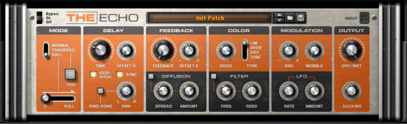

The first line of the Arturia Keyboad LCD should display "The Echo" and the second one, the name of the selected patch.

| Arturia Keyboard surface | Reason Command | Comment |
| -------------------------- | -------------- | ----------------------- |
| Master Fader | Ducking |  |
| Master Pan | Dry/Wet Balance |  |
| Encoder 1 | Delay Time |  |
| Encoder 2 | Right Ch Time Offset |  |
| Encoder 3 | Feedback |  |
| Encoder 4 | Right Ch Feedback Offset |  |
| Encoder 5 | Drive Amount |  |
| Encoder 6 | Drive Type |  |
| Encoder 7 | Envelope |  |
| Encoder 8 | Wobble |  |
| Fader 1 | Ping-Pong Mode |  |
| Fader 2 | Ping-Pong Pan |  |
| Fader 3 | Diffuse Spread |  |
| Fader 4 | Diffuse Amount |  |
| Fader 5 | Filter Frequency |  |
| Fader 6 | Filter Resonance |  |
| Fader 7 | LFO Rate |  |
| Fader 8 | LFO Amount |  |
| Jog Wheel | Select Previous/Next Preset | when "Preset" is selected |

## Mapping with the Pulveriser

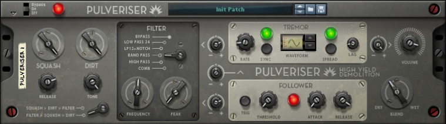

The first line of the Arturia Keyboad LCD should display "Pulveriser" and the second one, the name of the selected patch.

| Arturia Keyboard surface | Reason Command | Comment |
| -------------------------- | -------------- | ----------------------- |
| Master Fader | Blend |  |
| Master Pan | Volume |  |
| Encoder 1 | Squash |  |
| Encoder 2 | Dirt |  |
| Encoder 3 | Filter Mode |  |
| Encoder 4 | Tremor to Frequency |  |
| Encoder 5 | Follower to Rate |  |
| Encoder 6 | Tremor Rate |  |
| Encoder 7 | Tremor Lag |  |
| Encoder 8 | Tremor to Volume |  |
| Fader 1 | Release |  |
| Fader 2 | Tone |  |
| Fader 3 | Filter Frequency |  |
| Fader 4 | Peak |  |
| Fader 5 | Follower to Frequency |  |
| Fader 6 | Follower Threshold |  |
| Fader 7 | Follower Attack |  |
| Fader 8 | Follower Release |  |
| Jog Wheel | Select Previous/Next Preset | when "Preset" is selected |

## Mapping with the Softube BassAmp

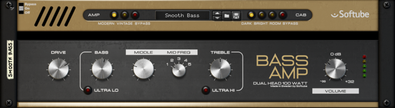

The first line of the Arturia Keyboad LCD should display "BassAmp" and the second one, the name of the selected patch.

| Arturia Keyboard surface | Reason Command | Comment |
| -------------------------- | -------------- | ----------------------- |
| Master Fader | Volume |  |
| Encoder 1 | Drive |  |
| Encoder 2 | Bass |  |
| Encoder 3 | Middle |  |
| Encoder 4 | Mid Freq |  |
| Encoder 5 | Treble|  |
| Fader 1 | Amp Switch |  |
| Fader 2 | Cab Switch |  |
| Jog Wheel | Select Previous/Next Preset | when "Preset" is selected |

## Mapping with the Softube Amp

The first line of the Arturia Keyboad LCD should display "Softube Amp" and the second one, the name of the selected patch.

| Arturia Keyboard surface | Reason Command | Comment |
| -------------------------- | -------------- | ----------------------- |
| Master Fader | Volume |  |
| Encoder 1 | Gate |  |
| Encoder 2 | Gain |  |
| Encoder 3 | Bass |  |
| Encoder 4 | Mid |  |
| Encoder 5 | Treble |  |
| Encoder 6 | Poweramp Gain |  |
| Fader 1 | Amp Switch |  |
| Fader 2 | Cab Switch |  |
| Jog Wheel | Select Previous/Next Preset | when "Preset" is selected |

## Mapping with the Synchronous Timed Effect Modulator

The first line of the Arturia Keyboad LCD should display "Synchronous" and the second one, the name of the selected patch.

| Arturia Keyboard surface | Reason Command | Comment |
| -------------------------- | -------------- | ----------------------- |
| Master Fader | Master level |  |
| Master Pan | Dry/Wet |  |
| Encoder 1 | Dist Amount |  |
| Encoder 2 | Dist Character |  |
| Encoder 3 | Filter Freq |  |
| Encoder 4 | Filter Reso |  |
| Encoder 5 | Delay  Amount |  |
| Encoder 6 | Delay Feedback |  |
| Encoder 7 | Reverb Amount |  |
| Encoder 8 | Reverb Decay |  |
| Fader 1 | Dist On/Off |  |
| Fader 2 | Filter On/Off |  |
| Fader 3 | Delay On/Off |  |
| Fader 4 | Reverb On/Off |  |
| Fader 8 | Level |  |
| Jog Wheel | Select Previous/Next Preset | when "Preset" is selected |

## Mapping with the Audiomatic Retro Transformer

The first line of the Arturia Keyboad LCD should display "Audiomatic" and the second one, the name of the selected patch.

| Arturia Keyboard surface | Reason Command | Comment |
| -------------------------- | -------------- | ----------------------- |
| Master Fader | Volume |  |
| Master Pan | Dry/Wet |  |
| Encoder 1 | Input Gain |  |
| Encoder 2 | Transform |  |
| Jog Wheel | Select Previous/Next Preset | when "Preset" is selected |

## Mapping with the Scream 4 Sound Destruction Unit

The first line of the Arturia Keyboad LCD should display "Scream 4" and the second one, the name of the selected patch.

| Arturia Keyboard surface | Reason Command | Comment |
| -------------------------- | -------------- | ----------------------- |
| Master Fader | Master level |  |
| Encoder 1 | Damage Control |  |
| Encoder 2 | Damage Type |  |
| Encoder 3 | Parameter 1 |  |
| Encoder 4 | Parameter 2 |  |
| Encoder 5 | Body Resonance |  |
| Encoder 6 | Body Scale |  |
| Encoder 7 | Body Auto |  |
| Encoder 8 | Body Type |  |
| Fader 1 | Cut Lo |  |
| Fader 2 | Cut Mid |  |
| Fader 3 | Cut Hi |  |
| Fader 6 | Damage On/Off |  |
| Fader 7 | Cut On/Off |  |
| Fader 8 | Body On/Off |  |
| Jog Wheel | Select Previous/Next Preset | when "Preset" is selected |

## Mapping with the BV512 Vocoder

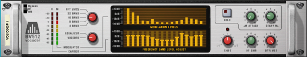

The first line of the Arturia Keyboad LCD should display "BV512 Vocoder" and the second one, the range of active's bandes depending which variation is active.

| Arturia Keyboard surface | Reason Command | Comment |
| -------------------------- | -------------- | ----------------------- |
| Master pan | Dry/Wet |  |
| Encoder 1 | Band Count |  |
| Encoder 2 | Vocoder/Equalizer |  |
| Encoder 3 | Attack |  |
| Encoder 4 | Decay |  |
| Encoder 5 | Shift |  |
| Encoder 6 | HF Emphasis |  |
| Fader <1-8> | Bande Level <1-8> | When "Band Lv 1-8" variation is active |
| Fader <1-8> | Bande Level <9-16> | When "Band Lv 9-16" variation is active |
| Fader <1-8> | Bande Level <17-24> | When "Band Lv 17-24" variation is active |
| Fader <1-8> | Bande Level <25-32> | When "Band Lv 25-32" variation is active |
| Part1 / Next| Keyboard Shortcut Variations | To switch between "Band Lv 1-8", "Band Lv 9-16", "Band Lv 17-24" & "Band Lv 25-32" variations |
| Part2 / Prev| Keyboard Shortcut Variations | To switch between "Band Lv 1-8", "Band Lv 9-16", "Band Lv 17-24" & "Band Lv 25-32" variations |

## Mapping with the Neptune Pitch Adjuster and Voice Synth

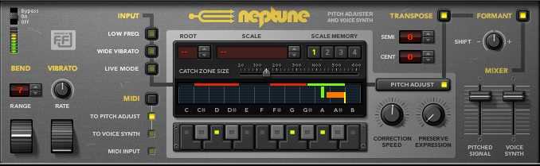

The first line of the Arturia Keyboad LCD should display "Neptune" and the second one, the target note name.

| Arturia Keyboard surface | Reason Command | Comment |
| -------------------------- | -------------- | ----------------------- |
| Encoder 1 | Pitch Bend Range |  |
| Encoder 2 | Vibrato Rate |  |
| Encoder 3 | Catch Zone |  |
| Encoder 4 | Cent |  |
| Encoder 5 | Semitones |  |
| Encoder 6 | Formant Shift |  |
| Fader 1 | Correction Speed |  |
| Fader 2 | Preserve Expression |  |
| Fader 3 | Pitched Signal Level |  |
| Fader 4 | Voice Synth Level |  |

## Mapping with the Reverb RV7000 Mk II Advanced Reverb

The first line of the Arturia Keyboad LCD should display "RV7000" and the second one, the name of the selected patch.

| Arturia Keyboard surface | Reason Command | Comment |
| -------------------------- | -------------- | ----------------------- |
| Encoder 1 | Decay |  |
| Encoder 2 | HF Damp |  |
| Encoder 3 | Hi EQ |  |
| Main Encoder | Dry/Wet |  |
| Fader <1-8> | Soft Knob <1-8> |  |
| Jog Wheel | Select Previous/Next Preset | when "Preset" is selected |

## Mapping with the MClass Equalizer

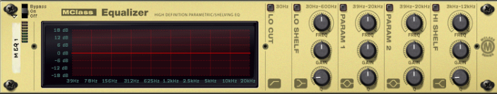

The first line of the Arturia Keyboad LCD should display "MClass" and the second one "Equalizer".

| Arturia Keyboard surface | Reason Command | Comment |
| -------------------------- | -------------- | ----------------------- |
| Encoder 1 | Low Shelf Frequency |  |
| Encoder 2 | Low Shelf Gain |  |
| Fader 1 | Low Shelf Q |  |
| Encoder 3 | Parametric 1 Frequency |  |
| Encoder 4 | Parametric 1 Gain |  |
| Fader 3 | Parametric 1 Q |  |
| Encoder 5 | Parametric 2 Frequency |  |
| Encoder 6 | Parametric 2 Gain |  |
| Fader 5 | Parametric 2 Q |  |
| Encoder 7 | Hi Shelf Frequency |  |
| Encoder 8 | Hi Shelf Gain |  |
| Fader 7 | Hi Shelf Q |  |

## Mapping with the MClass Compressor

The first line of the Arturia Keyboad LCD should display "MClass" and the second one "Comrpessor".

| Arturia Keyboard surface | Reason Command | Comment |
| -------------------------- | -------------- | ----------------------- |
| Encoder 1 | Input Gain |  |
| Encoder 2 | Threshold |  |
| Encoder 3 | Ratio |  |
| Encoder 4 | Attack |  |
| Encoder 5 | Release |  |
| Main Encoder | Output Gain |  |

## Mapping with the MClass Maximizer

The first line of the Arturia Keyboad LCD should display "MClass" and the second one "Maximizer".

| Arturia Keyboard surface | Reason Command | Comment |
| -------------------------- | -------------- | ----------------------- |
| Encoder 1 | Input Gain |  |
| Encoder 2 | Attack Speed |  |
| Encoder 3 | Release Speed |  |
| Encoder 4 | Output Gain |  |
| Encoder 5 | Soft Clip Amount |  |

## Mapping with the MClass Stereo Imager

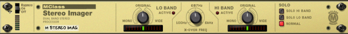

The first line of the Arturia Keyboad LCD should display "MClass" and the second one "Stereo Imager".

| Arturia Keyboard surface | Reason Command | Comment |
| -------------------------- | -------------- | ----------------------- |
| Encoder 1 | Low Width |  |
| Encoder 2 | X-Over Frequency|  |
| Encoder 3 | High Width |  |
| Encoder 4 | Solo Mode |  |

## Mapping with the RV-7 Digital Reverb

The first line of the Arturia Keyboad LCD should display "RV-7 (reverb)" and the second one the name of the selected algorithm.

| Arturia Keyboard surface | Reason Command | Comment |
| -------------------------- | -------------- | ----------------------- |
| Encoder 1 | Size |  |
| Encoder 2 | Decay |  |
| Encoder 3 | Damping |  |
| Encoder 4 | Dry/Wet |  |
| Jog Wheel | Select Previous/Next Algorithm | when "Preset" is selected |

## Mapping with the DDL-1 Digital Delay Line

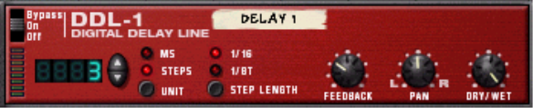

The first line of the Arturia Keyboad LCD should display "DDL-1 (delay)".

| Arturia Keyboard surface | Reason Command | Comment |
| -------------------------- | -------------- | ----------------------- |
| Encoder 1 | DelayTime (steps) |  |
| Encoder 2 | DelayTime (ms) |  |
| Encoder 3 | Feedback |  |
| Encoder 4 | Pan |  |
| Encoder 5 | Dry/Wet Balance |  |

## Mapping with the D-11 Foldback Distortion

The first line of the Arturia Keyboad LCD should display "D-11 (dist.)".

| Arturia Keyboard surface | Reason Command | Comment |
| -------------------------- | -------------- | ----------------------- |
| Encoder 1 | Amount |  |
| Encoder 2 | Foldback |  |

## Mapping with the ECF-42 Envelope Controlled Filter

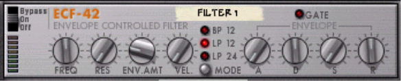

The first line of the Arturia Keyboad LCD should display "ECF-42 (filter)".

| Arturia Keyboard surface | Reason Command | Comment |
| -------------------------- | -------------- | ----------------------- |
| Encoder 1 | Frequency |  |
| Encoder 2 | Resonance |  |
| Encoder 3 | Env Amount |  |
| Encoder 4 | Velocity |  |
| Encoder 5 | Attack |  |
| Encoder 6 | Decay |  |
| Encoder 7 | Sustain |  |
| Encoder 8 | Release |  |
| Master Pan | Mode |  |

## Mapping with the CF-101 Chorus/Flanger

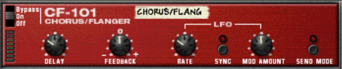

The first line of the Arturia Keyboad LCD should display "CF-101 (Ch/Fl)".

| Arturia Keyboard surface | Reason Command | Comment |
| -------------------------- | -------------- | ----------------------- |
| Encoder 1 | Delay |  |
| Encoder 2 | Feedback |  |
| Encoder 3 | Rate |  |
| Encoder 4 | Modulation Amount |  |

## Mapping with the PH-90 Phaser

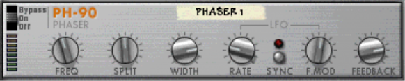

The first line of the Arturia Keyboad LCD should display "PH-90 (Phaser)".

| Arturia Keyboard surface | Reason Command | Comment |
| -------------------------- | -------------- | ----------------------- |
| Encoder 1 | Frequency |  |
| Encoder 2 | Split |  |
| Encoder 3 | Width |  |
| Encoder 4 | Rate |  |
| Encoder 5 | Frequency Modulation |  |
| Encoder 6 | Feedback |  |

## Mapping with the UN-16 Unison

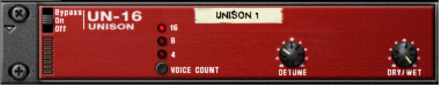

The first line of the Arturia Keyboad LCD should display "UN-16 (Unison)".

| Arturia Keyboard surface | Reason Command | Comment |
| -------------------------- | -------------- | ----------------------- |
| Encoder 1 | Voice Count |  |
| Encoder 2 | Detune |  |
| Encoder 3 | Dry/Wet |  |

## Mapping with the COMP-01 Auto Make-up Gain Compressor

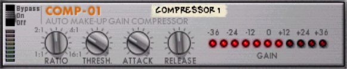

The first line of the Arturia Keyboad LCD should display "COMP-01 (Comp.)".

| Arturia Keyboard surface | Reason Command | Comment |
| -------------------------- | -------------- | ----------------------- |
| Encoder 1 | Ratio |  |
| Encoder 2 | Threshold |  |
| Encoder 3 | Attack |  |
| Encoder 4 | Release |  |
| Encoder 5 | Gain |  |

## Mapping with the PEQ-2 Two Band Parametric EQ

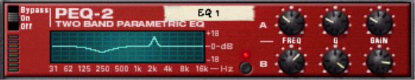

The first line of the Arturia Keyboad LCD should display "PEQ-2 (filter)".

| Arturia Keyboard surface | Reason Command | Comment |
| -------------------------- | -------------- | ----------------------- |
| Encoder 1 | Filter A Freq |  |
| Encoder 2 | Filter A Q |  |
| Encoder 3 | Filter A Gain |  |
| Encoder 4 | Filter B Freq |  |
| Encoder 5 | Filter B Q |  |
| Encoder 6 | Filter B Gain |  |

## Mapping with the MagmaSonic Classic Filter

The first line of the Arturia Keyboad LCD should display "MagmaSonic".

| Arturia Keyboard surface | Reason Command | Comment |
| -------------------------- | -------------- | ----------------------- |
| Encoder 1 | Cutoff |  |
| Encoder 2 | Resonance |  |
| Encoder 3 | Spice |  |
| Encoder 4 | Volume |  |

## Mapping with the Softube Saturation Knob

The first line of the Arturia Keyboad LCD should display "Saturation Knob" and the second one, the name of the selected patch.

| Arturia Keyboard surface | Reason Command | Comment |
| -------------------------- | -------------- | ----------------------- |
| Encoder 1 | Saturation |  |
| Encoder 2 | Saturation Type |  |
| Jog Wheel | Select Previous/Next Algorithm | when "Preset" is selected |

## Mapping with the Quartet Chorus Ensemble

The first line of the Arturia Keyboad LCD should display "Quartet" and the selected effect in brackets. The second line should display the name of the selected patch.

| Arturia Keyboard surface | Reason Command | Comment |
| -------------------------- | -------------- | ----------------------- |
| Encoder 1 | Chorus Delay | When the Chorus effect is selected |
| Encoder 2 | Chorus Depth | When the Chorus effect is selected  |
| Encoder 3 | Chorus Rate | When the Chorus effect is selected  |
| Encoder 4 | Chorus Feedback | When the Chorus effect is selected  |
| Encoder 5 | Chorus Width | When the Chorus effect is selected  |
| Master Pan | Chorus DryWet | When the Chorus effect is selected  |
| Encoder 1 | BBD Delay | When the BBD effect is selected |
| Encoder 2 | BBD Depth | When the BBD effect is selected  |
| Encoder 3 | BBD Rate | When the BBD effect is selected  |
| Encoder 4 | BBD Noise | When the BBD effect is selected  |
| Encoder 5 | BBD Width | When the BBD effect is selected  |
| Master Pan | BBD DryWet | When the BBD effect is selected  |
| Encoder 1 | FFT Size | When the FFT effect is selected |
| Encoder 2 | FFT Depth | When the FFT effect is selected  |
| Encoder 3 | FFT Start | When the FFT effect is selected  |
| Encoder 4 | FFT End | When the FFT effect is selected  |
| Encoder 5 | FFT Width | When the FFT effect is selected  |
| Master Pan | FFT DryWet | When the FFT effect is selected  |
| Encoder 1 | Grain Phase | When the FFT effect is selected |
| Encoder 2 | Grain Size | When the FFT effect is selected  |
| Encoder 3 | Grain Depth | When the FFT effect is selected  |
| Encoder 4 | Grain Jitter | When the FFT effect is selected  |
| Encoder 5 | Grain Density | When the FFT effect is selected  |
| Encoder 6 | Grain Width | When the FFT effect is selected  |
| Master Pan | Grain DryWet | When the FFT effect is selected  |
| Jog Wheel | Patch selection | when "Preset" is selected |
| Jog Wheel | Effect selection | when "Cat/Char" is selected |

## Mapping with the Sweeper Modulation Effect

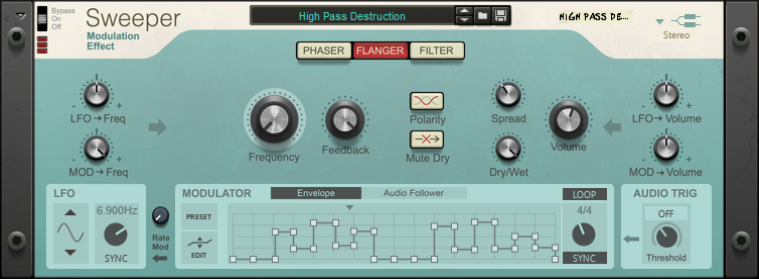

The first line of the Arturia Keyboad LCD should display "Sweeper" and the selected effect in brackets. The second line should display the name of the selected patch.

| Arturia Keyboard surface | Reason Command | Comment |
| -------------------------- | -------------- | ----------------------- |
| Encoder 1 | Freq |  |
| Encoder 2 | Bandwidth |  |
| Encoder 3 | Feedback |  |
| Encoder 4 | Filter Drive |  |
| Encoder 5 | Reso |  |
| Encoder 8 | Spread |  |
| Fader 1 | LFO Freq Mod |  |
| Fader 2 | Env Freq Mod |  |
| Fader 3 | LFO Amp Mod |  |
| Fader 4 | Env Amp Mod |  |
| Master Pan | DryWet |  |
| Master Volume | Volume |  |
| Jog Wheel | Patch selection | when "Preset" is selected |
| Jog Wheel | Effect type selection | when "Cat/Char" is selected |

## Mapping with the Master Bus Compressor

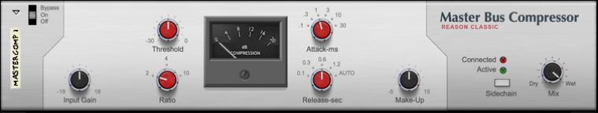

The first line of the Arturia Keyboad LCD should display "Master" and the second one "Bus Comrpessor".

| Arturia Keyboard surface | Reason Command | Comment |
| -------------------------- | -------------- | ----------------------- |
| Encoder 1 | Input Gain |  |
| Encoder 2 | Threshold |  |
| Encoder 3 | Ratio |  |
| Encoder 4 | Attack |  |
| Encoder 5 | Release |  |
| Encoder 5 | Make-Up Gain |  |
| Master Pan | Mix |  |

## Mapping with the Channel Dynamics Compressor and Gate

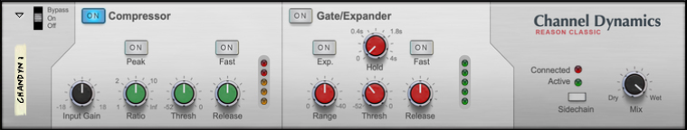

The first line of the Arturia Keyboad LCD should display "Channel Dynamics" and the second one "Comp. & Gate".

| Arturia Keyboard surface | Reason Command | Comment |
| -------------------------- | -------------- | ----------------------- |
| Encoder 1 | Input Gain |  |
| Encoder 2 | Comp Ratio |  |
| Encoder 3 | Comp Threshold |  |
| Encoder 4 | Comp Release |  |
| Encoder 5 | Gate Range |  |
| Encoder 6 | Gate Hold |  |
| Encoder 7 | Gate Threshold |  |
| Encoder 8 | GGate Release |  |
| Master Pan | Mix |  |

## Mapping with the Channel EQ Equalizer

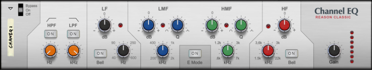

The first line of the Arturia Keyboad LCD should display "Channel EQ" and the second one "Equalizer".

| Arturia Keyboard surface | Reason Command | Comment |
| -------------------------- | -------------- | ----------------------- |
| Encoder 1 | HPF Frequency |  |
| Encoder 2 | LPF Frequency |  |
| Encoder 3 | LF Gain |  |
| Encoder 4 | LF Frequency|  |
| Encoder 5 | HF Gain |  |
| Encoder 6 | HF Frequency |  |
| Fader 1 | LMF Gain |  |
| Fader 2 | LMF Frequency |  |
| Fader 3 | LMF Q |  |
| Fader 4 | HMF Gain|  |
| Fader 5 | HMF Frequency |  |
| Fader 6 | HMF Q |  |
| Master Pan | Gain |  |
