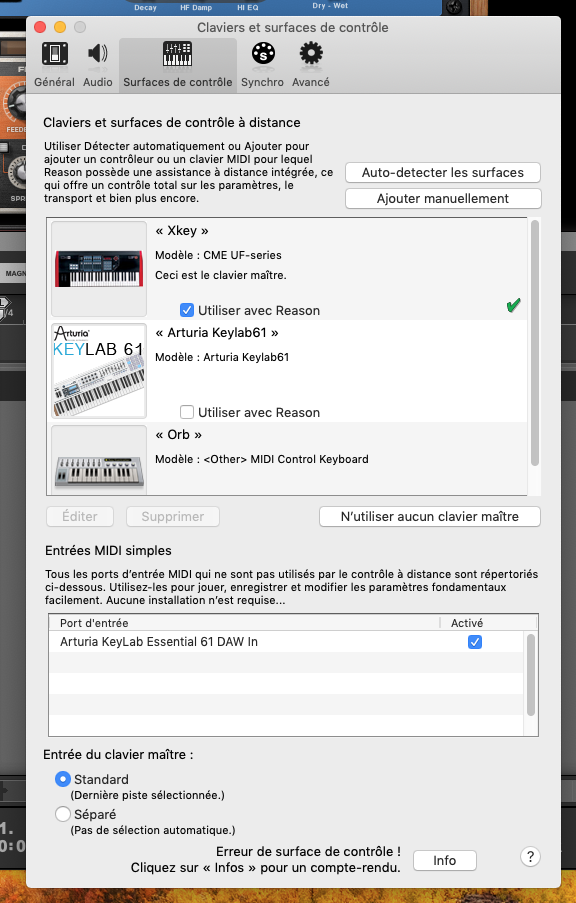
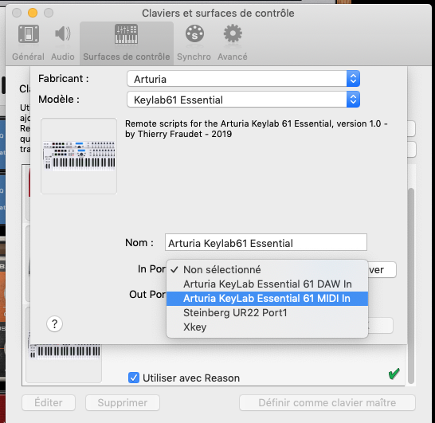
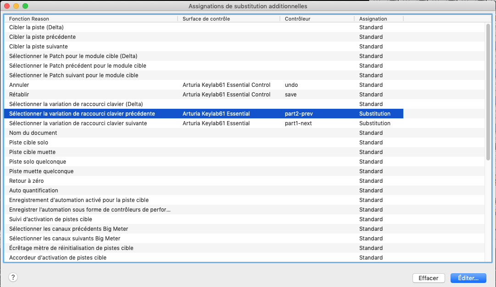

# Reason remote scripts for Arturia Keylab Essential

Remote is the Propellerheadʼs protocol for communication between hardware control surfaces and Reason Studio application. This project provides Reason remote scripts for the **DAW Command Center** surface of the Arturia Keylab Essential keyboard and the **keyboard** itself (pads, encoders and faders sections).


## Installation

### :one: Install the scripts

To install the Remote scripts in your environement, the files in the `Remote` directory should be copied to your Propellerhead installation directory:

* On MacOS

```bash
Macintosh HD/Library/Application Support/Propellerhead Software/Remote
```

* On Window 7 and above

```bash
C:/ProgramData/Propellerhead Software/Remote
```

### :two: Setup the Arturia Keylab61 Essential DAW Command Center as a control surface in Reason

* Open the Preferences dialog and click the Control Surfaces tab.



* To add manually the control surface, click the “Add manually” button. This brings up a new dialog.
* Select "Arturia Keylab 61 Essential Control" from the Model pop-up menu. Select `Arturia KeyLab 61 Essential DAW In` for `In Port` attribut and `Arturia Keylab Essential DAW Out` for `Out Port` attribut.


### :three: Setup the Arturia Keylab61 Essential keyboard as a control surface in Reason

* Open the Preferences dialog and click the Control Surfaces tab.
* To add manually the control surface, click the “Add manually” button. This brings up a new dialog.
* Select "Arturia Keylab 61 Essential" from the Model pop-up menu. Select `Arturia KeyLab 61 Essential MIDI In` for `In Port` attribut and `Arturia Keylab Essential MIDI Out` for `Out Port` attribut.
* optional: select `Arturia KeyLab 61 Essential` as the master keyboard



:exclamation: At that point youd should have 2 new control surfaces:

* `Arturia KeyLab 61 Essential Control` map to Arturia DAW Midi in & out ports
* `Arturia KeyLab 61 Essential` map to Arturia Midi in & out ports and defined as master keyboard


### :four: Set Keyboard Shortcut Variations

To change which keyboard shortcut variation is selected in Reason using the Arturia keyboard, map Previous/Next keyboard shortcut variation to `Arturia KeyLab 61 Essential` - `part2-prev/part1-next`



See [Reason doc](http://docs.propellerheads.se/reason10/wwhelp/wwhimpl/js/html/wwhelp.htm#context=EngOpManProjectPro&topic=PreferencesControlSurface) for more information

## Mapping between Arturia control surfaces and Reason

* [DAW commands & Master Section mapping](./daw-mapping.md)
* [Instruments mapping](./instruments-mapping.md)
* [Effects mapping](./effects-mapping.md)
* [Utilities mapping](./utilities-mapping.md)
* [Players mapping](./players-mapping.md)
