# Instruments mapping

* [ID8 instrument device](#mapping-with-the-id8-instrument-device)
* [SubTractor instrument device](#mapping-with-the-subtractor-instrument-device)
* [Thor instrument device](#mapping-with-the-thor-instrument-device)
* [Malstrom instrument device](#mapping-with-the-malstrom-instrument-device)
* [NN19 Digital Sampler](#mapping-with-the-nn19-digital-sampler)
* [NN-XT Advanced Sampler](#mapping-with-the-nn-xt-advanced-sampler)
* [Dr. Octo REX](#mapping-with-the-dr-octo-rex)
* [Redrum Drum Computer](#mapping-with-the-redrum-drum-computer)
* [Kong Drum Designer](#mapping-with-the-kong-drum-designer)
* [Europa Shapeshifting Synthesizer](#mapping-with-the-europa-shapeshifting-synthesizer)
* [Grain Sample Manipulator](#mapping-with-the-grain-sample-manipulator)
* [Monotone Bass Synthesizer](#mapping-with-the-monotone-bass-synthesizer)
* [Radical Piano](#mapping-with-the-radical-piano)
* [Klang Tuned Percussion](#mapping-with-the-klang-tuned-percussion)
* [Pangea World Instruments](#mapping-with-the-pangea-world-instruments)
* [Humana Vocal Ensemble](#mapping-with-the-humana-vocal-ensemble)
* [Rytmik Drum Machine](#mapping-with-the-rytmik-drum-machine)
* [A-List Acoustic Guitarist](#mapping-with-the-a-list-acoustic-guitarist)
* [Parsec Spectral Synthesizer](#mapping-with-the-parsec-spectral-synthesizer)
* [AutoTheory](#mapping-with-the-autotheory)
* [Mercury 4 Voice Polyphonic Arpeggiator](#mapping-with-the-mercury-4-voice-polyphonic-arpeggiator)
* [Nautilus Bass Synthesizer](#mapping-with-the-nautilus-bass-synthesizer)
* [Synapse Antidote](#mapping-with-the-synapse-antidote)
* [A-List Electric Guitarist - Pop Chords](#mapping-with-the-a-list-electric-guitarist---pop-chords)
* [A-List Acoustic Guitarist - Fingerpicking Nylon](#mapping-with-the-a-list-acoustic-guitarist---fingerpicking-nylon)
* [A-List Electric Guitarist - Power Chords](#mapping-with-the-a-list-electric-guitarist---power-chords)

## Mapping with the ID8 instrument device

The first line of the Arturia Keyboard LCD should display "ID8" and the second one the preset name.

| Arturia Keyboard surface | Reason Command | Comment |
| -------------------------- | -------------- | ----------------------- |
| Master fader | Volume |  |
| Fader 1 | Parameter 1 |  |
| Fader 2 | Parameter 2 |  |
| Jog-wheel | Select Previous/Next Category | when "Cat/Char" is selected |
| Jog-wheel | Select Previous/Next Sound | when "Preset" is selected |
| Left arrow | Select Previous Preset |  |
| Right arrow | Select Next Preset |  |

## Mapping with the SubTractor instrument device

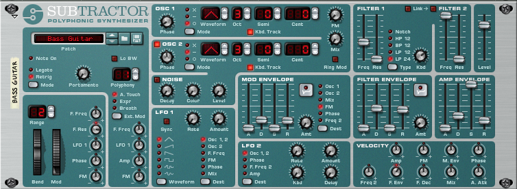

The first line of the Arturia Keyboard LCD should display "SubTractor" and the second one the preset name.

| Arturia Keyboard surface | Reason Command | Comment |
| -------------------------- | -------------- | ----------------------- |
| Master fader | Volume |  |
| Fader 1 | Filter Env Attack |  |
| Fader 2 | Filter Env Decay |  |
| Fader 3 | Filter Env Sustain |  |
| Fader 4 | Filter Env Release |  |
| Fader 5 | Amp Env Attack |  |
| Fader 6 | Amp Env Decay |  |
| Fader 7 | Amp Env Sustain |  |
| Fader 8 | Amp Env Release |  |
| Encoder 1 | Osc1 Phase Diff |  |
| Encoder 2 | Osc2 Phase Diff |  |
| Encoder 3 | Osc1 Wave |  |
| Encoder 4 | Osc2 Wave |  |
| Encoder 5 | Filter Freq |  |
| Encoder 6 | Filter Res |  |
| Encoder 7 | Filter2 Freq |  |
| Encoder 8 | Filter2 Res |  |
| Jog-wheel | Select Previous/Next Preset | when "Preset" is selected |

## Mapping with the Thor instrument device

The first line of the Arturia Keyboard LCD should display "Thor" and the second one the preset name.

| Arturia Keyboard surface | Reason Command | Comment |
| -------------------------- | -------------- | ----------------------- |
| Master fader | Volume |  |
| Fader 1 | Filter Env Attack |  |
| Fader 2 | Filter Env Decay |  |
| Fader 3 | Filter Env Sustain |  |
| Fader 4 | Filter Env Release |  |
| Fader 5 | Amp Env Attack |  |
| Fader 6 | Amp Env Decay |  |
| Fader 7 | Amp Env Sustain |  |
| Fader 8 | Amp Env Release |  |
| Encoder 1 | Filter 1 Freq |  |
| Encoder 2 | Filter 1 Res |  |
| Encoder 3 | Filter 2 Freq |  |
| Encoder 4 | Filter 2 Res |  |
| Encoder 5 | Filter 3 Freq |  |
| Encoder 6 | Filter 3 Res |  |
| Encoder 7 | Rotary 1 |  |
| Encoder 8 | Rotary 2 |  |
| Jog-wheel | Select Previous/Next Preset | when "Preset" is selected |

## Mapping with the Malstrom instrument device

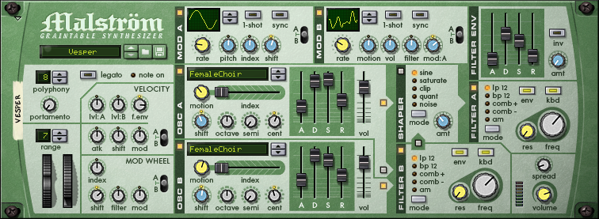

The first line of the Arturia Keyboard LCD should display "Malstrom" and "(Osc-A)" or "(Osc-B)" depending which variation is active. The second line display the preset name.

| Arturia Keyboard surface | Reason Command | Comment |
| -------------------------- | -------------- | ----------------------- |
| Master fader | Volume |  |
| Fader 1 | Filter Env Attack |  |
| Fader 2 | Filter Env Decay |  |
| Fader 3 | Filter Env Sustain |  |
| Fader 4 | Filter Env Release |  |
| Fader 5 | Oscillator A Attack | When Osc-A variation is active |
| Fader 6 | Oscillator A Decay | When Osc-A variation is active |
| Fader 7 | Oscillator A Sustain | When Osc-A variation is active |
| Fader 8 | Oscillator A Release | When Osc-A variation is active |
| Fader 5 | Oscillator B Attack | When Osc-B variation is active |
| Fader 6 | Oscillator B Decay | When Osc-B variation is active |
| Fader 7 | Oscillator B Sustain | When Osc-B variation is active |
| Fader 8 | Oscillator B Release | When Osc-B variation is active |
| Encoder 1 | Filter A Freq |  |
| Encoder 2 | Filter A Res |  |
| Encoder 3 | Filter B Freq |  |
| Encoder 4 | Filter B Res |  |
| Encoder 5 | Modulator A Rate |  |
| Encoder 6 | Modulator B Rate |  |
| Encoder 7 | Oscillator A Motion |  |
| Encoder 8 | Oscillator B Motion |  |
| Part1 / Next| Keyboard Shortcut Variations | To select Osc-B variation |
| Part2 / Prev| Keyboard Shortcut Variations | To select Osc-A variation |
| Jog-wheel | Select Previous/Next Preset | when "Preset" is selected |

## Mapping with the NN19 Digital Sampler

The first line of the Arturia Keyboard LCD should display "NN19" and the second one the preset name.

| Arturia Keyboard surface | Reason Command | Comment |
| -------------------------- | -------------- | ----------------------- |
| Master fader | Volume |  |
| Fader 1 | Filter Env Attack |  |
| Fader 2 | Filter Env Decay |  |
| Fader 3 | Filter Env Sustain |  |
| Fader 4 | Filter Env Release |  |
| Fader 5 | Amp Env Attack |  |
| Fader 6 | Amp Env Decay |  |
| Fader 7 | Amp Env Sustain |  |
| Fader 8 | Amp Env Release |  |
| Encoder 1 | Filter Freq |  |
| Encoder 2 | Filter Res |  |
| Encoder 3 | LFO Rate |  |
| Encoder 4 | LFO Amount |  |
| Encoder 5 | Filter Kbd Track |  |
| Encoder 6 | Filter Env Amount |  |
| Encoder 7 | Osc Octave |  |
| Encoder 8 | Osc Semitone |  |
| Jog-wheel | Select Previous/Next Preset | when "Preset" is selected |

## Mapping with the NN-XT Advanced Sampler

The first line of the Arturia Keyboard LCD should display "NN-XT" and the second one the preset name.

| Arturia Keyboard surface | Reason Command | Comment |
| -------------------------- | -------------- | ----------------------- |
| Master fader | Volume |  |
| Master pan | External Controler |  |
| Encoder 1 | Filter Freq |  |
| Encoder 2 | Filter Res |  |
| Encoder 3 | Amp Env Attack |  |
| Encoder 4 | Amp Env Decay |  |
| Encoder 5 | Amp Env Release|  |
| Encoder 6 | Mod env Decay |  |
| Jog-wheel | Select Previous/Next Preset | when "Preset" is selected |

## Mapping with the Dr. Octo REX

The first line of the Arturia Keyboard LCD should display "Dr. Octo REX" and the second one the preset name.

| Arturia Keyboard surface | Reason Command | Comment |
| -------------------------- | -------------- | ----------------------- |
| Master fader | Volume |  |
| Master pan | Transpose |  |
| Fader 1 | Filter Env Attack |  |
| Fader 2 | Filter Env Decay |  |
| Fader 3 | Filter Env Sustain |  |
| Fader 4 | Filter Env Release |  |
| Fader 5 | Amp Env Attack |  |
| Fader 6 | Amp Env Decay |  |
| Fader 7 | Amp Env Sustain |  |
| Fader 8 | Amp Env Release |  |
| Encoder 1 | Filter Freq |  |
| Encoder 2 | Filter Res |  |
| Encoder 3 | Filter Env Amount |  |
| Encoder 4 | LFO1 Rate|  |
| Encoder 5 | LFO1 Amount|  |
| Encoder 6 | Filter Mode |  |
| Encoder 7 | LFO1 Wave |  |
| Encoder 8 | LFO1 Dest |  |
| Jog-wheel | Select Previous/Next Preset | when "Preset" is selected |

## Mapping with the Redrum Drum Computer

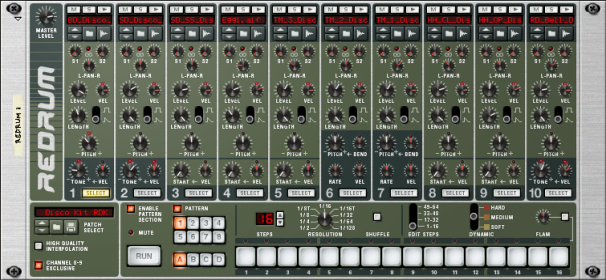

The first line of the Arturia Keyboard LCD should display "Redrum" and "Ch1-8" or "Ch9-10" depending which variation is active. The second line display the preset name.

| Arturia Keyboard surface | Reason Command | Comment |
| -------------------------- | -------------- | ----------------------- |
| Master fader | Master level|  |
| Fader <1-8> | Drum <1-8> Level | When "Ch1-8" variation is active |
| Encoder <1-8> | Drum <1-8> Pan | When "Ch1-8" variation is active |
| Fader <1-2> | Drum <9-10> Level | When "Ch9-10" vartiona is active |
| Encoder <1-2> | Drum <9-10> Pan | When "Ch9-10" variation is active |
| Part1 / Next| Keyboard Shortcut Variations | To select Channels 9 to 10 variation |
| Part2 / Prev| Keyboard Shortcut Variations | To select Channels 1 to 8 variation |
| Jog-wheel | Select Previous/Next Preset | when "Preset" is selected |

## Mapping with the Kong Drum Designer

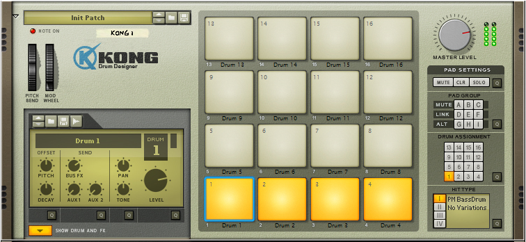

The first line of the Arturia Keyboard LCD should display "Kong" and "Ch1-8" or "Ch9-16" depending which variation is active. The second line display the preset name.

| Arturia Keyboard surface | Reason Command | Comment |
| -------------------------- | -------------- | ----------------------- |
| Master fader | Master level|  |
| Fader <1-8> | Drum <1-8> Level | When "Ch1-8" variation is active |
| Encoder <1-8> | Drum <1-8> Pan | When "Ch1-8" variation is active |
| Fader <1-8> | Drum <9-16> Level | When "Ch9-16" variation is active |
| Encoder <1-8> | Drum <9-16> Pan | When "Ch9-16" variation is active |
| Part1 / Next| Keyboard Shortcut Variations | To select Channels 9 to 16 variation |
| Part2 / Prev| Keyboard Shortcut Variations | To select Channels 1 to 8 variation |
| Jog-wheel | Select Previous/Next Preset | when "Preset" is selected |

## Mapping with the Europa Shapeshifting Synthesizer

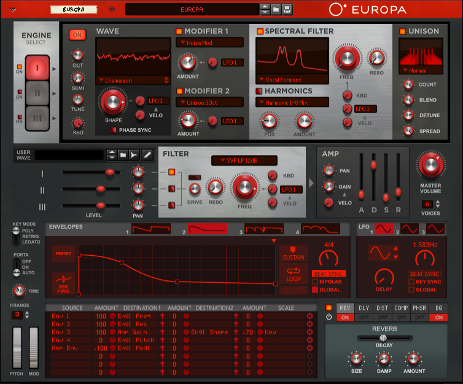

The first line of the Arturia Keyboard LCD should display "Europa" and "Osc<1-3>" depending which variation is active. The second line display the preset name.

| Arturia Keyboard surface | Reason Command | Comment |
| -------------------------- | -------------- | ----------------------- |
| Master fader | Volume |  |
| Fader 1 | Amp Attack |  |
| Fader 2 | Amp Decay |  |
| Fader 3 | Amp Sustain |  |
| Fader 4 | AmpRelease |  |
| Encoder 1 | Filter Drive |  |
| Encoder 2 | Filter Reso |  |
| Encoder 3 | Filter Freq |  |
| Encoder 7 | Osc1 Filter Freq | When "Osc1" variation is active |
| Encoder 8 | Osc1 Filter Reso | When "Osc1" variation is active |
| Encoder 7 | Osc2 Filter Freq | When "Osc2" variation is active |
| Encoder 8 | Osc2 Filter Reso | When "Osc2" variation is active |
| Encoder 7 | Osc3 Filter Freq | When "Osc3" variation is active |
| Encoder 8 | Osc3 Filter Reso | When "Osc3" variation is active |
| Jog-wheel | Select Previous/Next Preset | when "Preset" is selected |

## Mapping with the Grain Sample Manipulator

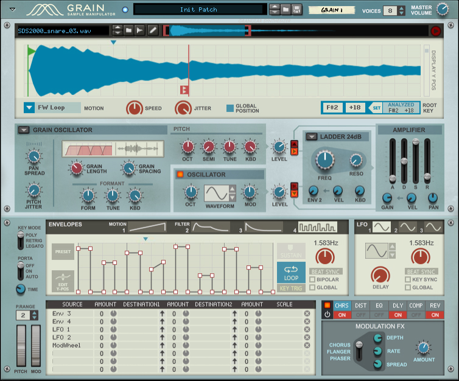

The first line of the Arturia Keyboard LCD should display "Grain". The second line display the preset name.

| Arturia Keyboard surface | Reason Command | Comment |
| -------------------------- | -------------- | ----------------------- |
| Master fader | Master Volume |  |
| Master pan | Voices |  |
| Fader 1 | Amp Attack |  |
| Fader 2 | Amp Decay |  |
| Fader 3 | Amp Sustain |  |
| Fader 4 | Amp Release |  |
| Fader 5 | Amp Gain |  |
| Fader 6 | Amp Velocity |  |
| Fader 7 | Amp Pan |  |
| Encoder 1 | Sample Level |  |
| Encoder 2 | Osc Level |  |
| Encoder 3 | Filter Freq |  |
| Encoder 4 | Filter Reso|  |
| Encoder 5 | Filter Env2 |  |
| Encoder 6 | Filter Vel | |
| Encoder 7 | Filter Kbd|  |
| Jog-wheel | Select Previous/Next Preset | when "Preset" is selected |

## Mapping with the Monotone Bass Synthesizer

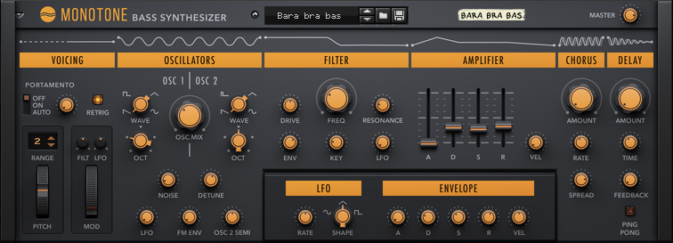

The first line of the Arturia Keyboard LCD should display "Grain". The second line display the preset name.

| Arturia Keyboard surface | Reason Command | Comment |
| -------------------------- | -------------- | ----------------------- |
| Master fader | Master Volume |  |
| Fader 1 | Amp Attack |  |
| Fader 2 | Amp Decay |  |
| Fader 3 | Amp Sustain |  |
| Fader 4 | Amp Release |  |
| Fader 5 | Amp Velocity |  |
| Encoder 1 | Osc Mix |  |
| Encoder 2 | Filter Freq |  |
| Encoder 3 | Filter Reso |  |
| Encoder 4 | Filter Attack |  |
| Encoder 5 | Filter Decay|  |
| Encoder 6 | Filter Sustain | |
| Encoder 7 | Filter Release |  |
| Encoder 8 | Filter Vel |  |
| Jog-wheel | Select Previous/Next Preset | when "Preset" is selected |

## Mapping with the Radical Piano

The first line of the Arturia Keyboard LCD should display "Radical Piano". The second line display the preset name.

| Arturia Keyboard surface | Reason Command | Comment |
| -------------------------- | -------------- | ----------------------- |
| Master fader | Master Volume |  |
| Fader 1 | Env Attack|  |
| Fader 2 | Env Decay Curve|  |
| Fader 3 | Env Release |  |
| Encoder 1 | Character|  |
| Encoder 2 | Microphone 1 Type|  |
| Encoder 3 | Microphone and Instrument Blend |  |
| Encoder 4 | Microphone 2 Type |  |
| Jog-wheel | Select Previous/Next Preset | when "Preset" is selected |

## Mapping with the Klang Tuned Percussion

The first line of the Arturia Keyboard LCD should display "Klang". The second line display the preset name.

| Arturia Keyboard surface | Reason Command | Comment |
| -------------------------- | -------------- | ----------------------- |
| Master fader | Master Volume |  |
| Master pan | Pitch Bend Range |  |
| Fader 1 | Filter Attack |  |
| Fader 2 | Filter Decay |  |
| Fader 3 | Filter Sustain |  |
| Fader 4 | Filter Release |  |
| Fader 5 | Amp Attack |  |
| Fader 6 | Amp Decay |  |
| Fader 7 | Amp Sustain |  |
| Fader 8 | Amp Release |  |
| Encoder 1 | Filter Cutoff|  |
| Encoder 2 | Filter Reso |  |
| Encoder 3 | Filter Env|  |
| Encoder 4 | Amp Velocity |  |
| Encoder 5 | Synced Delay Time |  |
| Encoder 6 | Delay Feedback | |
| Encoder 7 | Reverb Time |  |
| Encoder 8 | Reverb PreDelay|  |
| Jog-wheel | Select Previous/Next Preset | when "Preset" is selected |

## Mapping with the Pangea World Instruments

The first line of the Arturia Keyboard LCD should display "Pangea". The second line display the preset name.

| Arturia Keyboard surface | Reason Command | Comment |
| -------------------------- | -------------- | ----------------------- |
| Master fader | Master Volume |  |
| Master pan | Pitch Bend Range |  |
| Fader 1 | Filter Attack |  |
| Fader 2 | Filter Decay |  |
| Fader 3 | Filter Sustain |  |
| Fader 4 | Filter Release |  |
| Fader 5 | Amp Attack |  |
| Fader 6 | Amp Decay |  |
| Fader 7 | Amp Sustain |  |
| Fader 8 | Amp Release |  |
| Encoder 1 | Filter Cutoff|  |
| Encoder 2 | Filter Reso |  |
| Encoder 3 | Filter Env|  |
| Encoder 4 | Amp Velocity |  |
| Encoder 5 | Synced Delay Time |  |
| Encoder 6 | Delay Feedback | |
| Encoder 7 | Reverb Time |  |
| Encoder 8 | Reverb PreDelay|  |
| Jog-wheel | Select Previous/Next Preset | when "Preset" is selected |

## Mapping with the Humana Vocal Ensemble

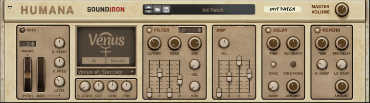

The first line of the Arturia Keyboard LCD should display "Humana". The second line display the preset name.

| Arturia Keyboard surface | Reason Command | Comment |
| -------------------------- | -------------- | ----------------------- |
| Master fader | Master Volume |  |
| Master pan | Pitch Bend Range |  |
| Fader 1 | Filter Attack |  |
| Fader 2 | Filter Decay |  |
| Fader 3 | Filter Sustain |  |
| Fader 4 | Filter Release |  |
| Fader 5 | Amp Attack |  |
| Fader 6 | Amp Decay |  |
| Fader 7 | Amp Sustain |  |
| Fader 8 | Amp Release |  |
| Encoder 1 | Filter Cutoff|  |
| Encoder 2 | Filter Reso |  |
| Encoder 3 | Filter Env|  |
| Encoder 4 | Amp Velocity |  |
| Encoder 5 | Synced Delay Time |  |
| Encoder 6 | Delay Feedback | |
| Encoder 7 | Reverb Time |  |
| Encoder 8 | Reverb PreDelay|  |
| Jog-wheel | Select Previous/Next Preset | when "Preset" is selected |

## Mapping with the Rytmik Drum Machine

The first line of the Arturia Keyboard LCD should display "Rytmik" follow by "Level" or "FX" depending which variation is active. The second line display the preset name.

| Arturia Keyboard surface | Reason Command | Comment |
| -------------------------- | -------------- | ----------------------- |
| Master fader | Master Volume |  |
| Fader <1-8> | Drum <1-8> Volume | when variation "Level" is active |
| Fader <1-8> | Drum <1-8> Reverb Amount | when variation "FX" is active |
| Encoder <1-8> | Drum <1-8> Delay Amount | when variation "FX" is active |
| Encoder 1 | Master Pitch | when variation "Level" is active |
| Encoder 2 | Master Reverb | when variation "Level" is active |
| Encoder 3 | Master Filter | when variation "Level" is active |
| Part1 / Next| Keyboard Shortcut Variations | To select FX variation |
| Part2 / Prev| Keyboard Shortcut Variations | To select Level variation |
| Jog-wheel | Select Previous/Next Preset | when "Preset" is selected |

## Mapping with the A-List Acoustic Guitarist

The first line of the Arturia Keyboard LCD should display "Acoustic Guitar". The second line display the preset name.

| Arturia Keyboard surface | Reason Command | Comment |
| -------------------------- | -------------- | ----------------------- |
| Encoder 1 | Character |  |
| Encoder 2 | Position |  |
| Encoder 3 | Style |  |
| Encoder 4 | Swing |  |
| Encoder 5 | Feel |  |
| Encoder 6 | Shimmer | |
| Encoder 7 | Attack |  |
| Master fader | Volume |  |
| Jog-wheel | Select Previous/Next Preset | when "Preset" is selected |

## Mapping with the Parsec Spectral Synthesizer

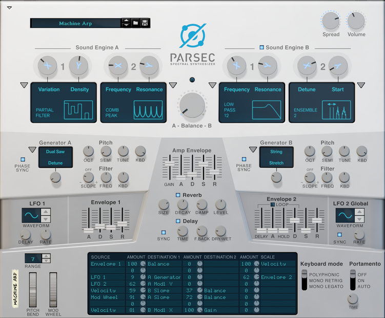

The first line of the Arturia Keyboard LCD should display "Parsec". The second line display the preset name.

| Arturia Keyboard surface | Reason Command | Comment |
| -------------------------- | -------------- | ----------------------- |
| Master fader | Master Level |  |
| Master pan | Balance |  |
| Encoder 1 | A Mod1 X |  |
| Encoder 2 | A Mod1 Y |  |
| Encoder 3 | A Mod2 X |  |
| Encoder 4 | A Mod2 Y |  |
| Encoder 5 | B Mod1 X |  |
| Encoder 6 | B Mod1 Y | |
| Encoder 7 | B Mod2 X |  |
| Encoder 8 | B Mod2 Y |  |
| Fader 1 | Env1 Attack |  |
| Fader 2 | Env1 Decay|  |
| Fader 3 | Env1 Sustain |  |
| Fader 4 | Env1 Release |  |
| Fader 5 | Env2 Attack|  |
| Fader 6 | Env2 Decay|  |
| Fader 7 | Env2 Sustain |  |
| Fader 8 | Env2 Release|  |
| Jog-wheel | Select Previous/Next Preset | when "Preset" is selected |

## Mapping with the AutoTheory

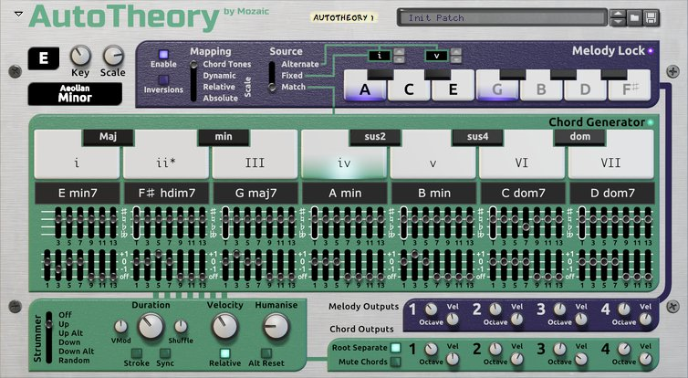

The first line of the Arturia Keyboard LCD should display "AutoTheory". The second line display the preset name.

| Arturia Keyboard surface | Reason Command | Comment |
| -------------------------- | -------------- | ----------------------- |
| Encoder 1 | Key |  |
| Encoder 2 | Scale |  |
| Encoder 3 | Strummer Duration |  |
| Encoder 4 | Strummer Absolute Velocity |  |
| Encoder 5 | Strummer Humanise Amount |  |
| Jog-wheel | Select Previous/Next Preset | when "Preset" is selected |

## Mapping with the Mercury 4 Voice Polyphonic Arpeggiator

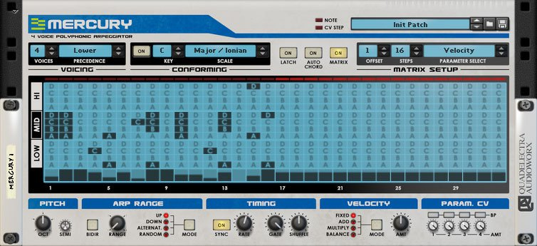

The first line of the Arturia Keyboard LCD should display "Mercury". The second line display the preset name.

| Arturia Keyboard surface | Reason Command | Comment |
| -------------------------- | -------------- | ----------------------- |
| Encoder 1 | Octave |  |
| Encoder 2 | Octave Range |  |
| Encoder 3 | Direction Mode |  |
| Encoder 4 | Rate (Synced) |  |
| Encoder 5 | Gate Length |  |
| Encoder 6 | Shuffle |  |
| Encoder 7 | Velocity Mode |  |
| Encoder 8 | Velocity Amount |  |
| Jog-wheel | Select Previous/Next Preset | when "Preset" is selected |

## Mapping with the Nautilus Bass Synthesizer

The first line of the Arturia Keyboard LCD should display "Nautilus". The second line display the preset name.

| Arturia Keyboard surface | Reason Command | Comment |
| -------------------------- | -------------- | ----------------------- |
| Master fader | Master Volume |  |
| Encoder 1 | Saw Pan |  |
| Encoder 2 | Square Pan |  |
| Encoder 3 | Sine Pan |  |
| Encoder 4 | Filter Env |  |
| Encoder 5 | Filter Cutoff |  |
| Encoder 6 | Filter Resonance |  |
| Fader 1 | Amp Attack |  |
| Fader 2 | Amp Decay |  |
| Fader 3 | Amp Sustain |  |
| Fader 4 | Amp Release |  |
| Fader 5 | Filter Attack|  |
| Fader 6 | Filter Decay|  |
| Fader 7 | Filter Sustain |  |
| Fader 8 | Filter Release|  |
| Jog-wheel | Select Previous/Next Preset | when "Preset" is selected |

## Mapping with the Synapse Antidote

The first line of the Arturia Keyboard LCD should display "Antidote" and "(Osc1)" or "(Osc2)" depending which variation is active. The second line display the preset name.

| Arturia Keyboard surface | Reason Command | Comment |
| -------------------------- | -------------- | ----------------------- |
| Master fader | Master Volume |  |
| Master fader | Glide |  |
| Encoder 1 | Osc 1 Semi | When "Osc1" variation is active |
| Encoder 2 | Osc 1 Fine | When "Osc1" variation is active |
| Encoder 3 | Osc 1 Detune | When "Osc1" variation is active |
| Encoder 4 | Osc 1 Spread | When "Osc1" variation is active |
| Encoder 5 | Osc 1 Phase | When "Osc1" variation is active |
| Encoder 6 | Osc 1 Modifier | When "Osc1" variation is active |
| Encoder 7 | Osc 1 Key Track | When "Osc1" variation is active |
| Encoder 8 | Osc 1 Pan | When "Osc1" variation is active |
| Encoder 1 | Osc 2 Semi | When "Osc2" variation is active |
| Encoder 2 | Osc 2 Fine | When "Osc2" variation is active |
| Encoder 3 | Osc 2 Detune | When "Osc2" variation is active |
| Encoder 4 | Osc 2 Spread | When "Osc2" variation is active |
| Encoder 5 | Osc 2 Phase | When "Osc2" variation is active |
| Encoder 6 | Osc 2 Modifier | When "Osc2" variation is active |
| Encoder 7 | Osc 2 Key Track | When "Osc2" variation is active |
| Encoder 8 | Osc 2 Pan | When "Osc2" variation is active |
| Fader 1 | Osc 1 Volume |  |
| Fader 2 | Osc 2 Volume |  |
| Fader 3 | Sub 1 Volume |  |
| Fader 4 | Sub 2 Volume |  |
| Fader 5 | Drift |  |
| Part1 / Next | Keyboard Shortcut Variations | To select Osc 2 variation |
| Part2 / Prev | Keyboard Shortcut Variations | To select Osc 1 variation |
| Jog-wheel | Select Previous/Next Preset | when "Preset" is selected |

## Mapping with the A-List Electric Guitarist - Pop Chords

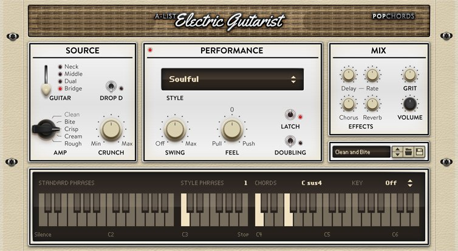

The first line of the Arturia Keyboard LCD should display "ElG Pop Chords". The second line display the preset name.

| Arturia Keyboard surface | Reason Command | Comment |
| -------------------------- | -------------- | ----------------------- |
| Encoder 1 | Guitar |  |
| Encoder 2 | Amp |  |
| Encoder 3 | Crunch |  |
| Encoder 4 | Style |  |
| Encoder 5 | Swing |  |
| Encoder 6 | Feel | |
| Master fader | Volume |  |
| Jog-wheel | Select Previous/Next Preset | when "Preset" is selected |

## Mapping with the A-List Acoustic Guitarist - Fingerpicking Nylon

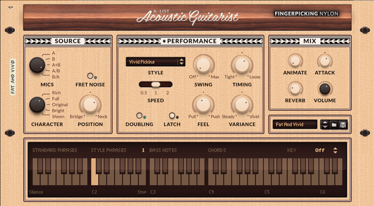

The first line of the Arturia Keyboard LCD should display "Fingerpicking Ny". The second line display the preset name.

| Arturia Keyboard surface | Reason Command | Comment |
| -------------------------- | -------------- | ----------------------- |
| Encoder 1 | Mics |  |
| Encoder 2 | Character |  |
| Encoder 3 | Position |  |
| Encoder 4 | Style |  |
| Encoder 5 | Swing |  |
| Encoder 6 | Timing | |
| Encoder 7 | Feel | |
| Encoder 8 | Variance | |
| Master fader | Volume |  |
| Jog-wheel | Select Previous/Next Preset | when "Preset" is selected |

## Mapping with the A-List Electric Guitarist - Power Chords

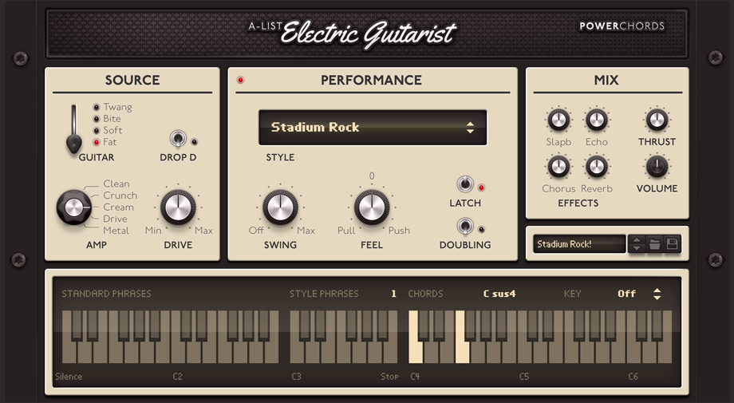

The first line of the Arturia Keyboard LCD should display "ElG Power Chords". The second line display the preset name.

| Arturia Keyboard surface | Reason Command | Comment |
| -------------------------- | -------------- | ----------------------- |
| Encoder 1 | Guitar |  |
| Encoder 2 | Amp |  |
| Encoder 3 | Drive |  |
| Encoder 4 | Style |  |
| Encoder 5 | Swing |  |
| Encoder 6 | Feel | |
| Master fader | Volume |  |
| Jog-wheel | Select Previous/Next Preset | when "Preset" is selected |
