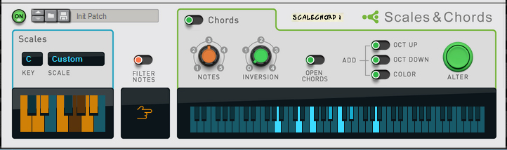
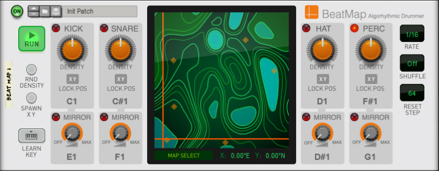

# Players mapping

* [Scales & Chords](#mapping-with-scales--chords)
* [Note Echo](#mapping-with-note-echo)
* [Dual Arpeggio](#mapping-with-dual-arpeggio)
* [Drum Sequencer](#mapping-with-drum-sequencer)
* [Beat Map](#mapping-with-beat-map)

## Mapping with Scales & Chords

The first line of the Arturia Keyboard LCD should display "Scales & Chords" and the second one, the name of the selected patch.

| Arturia Keyboard surface | Reason Command | Comment |
| -------------------------- | -------------- | ----------------------- |
| Encoder 1 | Key |  |
| Encoder 2 | Scale |  |
| Encoder 3 | Notes |  |
| Encoder 4 | Inversion |  |
| Jog Wheel | Select Previous/Next Preset | when "Preset" is selected |

## Mapping with Note Echo

The first line of the Arturia Keyboard LCD should display "Note Echo" and the second one, the name of the selected patch.

| Arturia Keyboard surface | Reason Command | Comment |
| -------------------------- | -------------- | ----------------------- |
| Encoder 1 | Step Length Synced |  |
| Encoder 2 | Repeats |  |
| Encoder 3 | Velocity |  |
| Encoder 4 | Pitch |  |
| Jog Wheel | Select Previous/Next Preset | when "Preset" is selected |

## Mapping with Dual Arpeggio

The first line of the Arturia Keyboard LCD should display "Dual Arpeggio" and the second one, the name of the selected patch.

| Arturia Keyboard surface | Reason Command | Comment |
| -------------------------- | -------------- | ----------------------- |
| Encoder 1 | Low Key 1 |  |
| Encoder 2 | High Key 1 |  |
| Encoder 3 | Rate 1 |  |
| Encoder 4 | Octaves 1 |  |
| Encoder 5 | Direction 1 |  |
| Encoder 6 | Shift Step 1 |  |
| Encoder 7 | Transpose 1 |  |
| Encoder 8 | Gate Length 1 |  |
| Fader 1 | Low Key 2 |  |
| Fader 2 | High Key 2 |  |
| Fader 3 | Rate 2 |  |
| Fader 4 | Octaves 2 |  |
| Fader 5 | Direction 2 |  |
| Fader 6 | Shift Step 2 |  |
| Fader 7 | Transpose 2 |  |
| Fader 8 | Gate Length 2 |  |
| Jog Wheel | Select Previous/Next Preset | when "Preset" is selected |

## Mapping with Drum Sequencer

The first line of the Arturia Keyboard LCD should display "Drum Sequencer" and the second one, the name of the selected patch.

| Arturia Keyboard surface | Reason Command | Comment |
| -------------------------- | -------------- | ----------------------- |
| Master pan | Pattern Select |  |
| Jog Wheel | Select Previous/Next Preset | when "Preset" is selected |

## Mapping with Beat Map

The first line of the Arturia Keyboard LCD should display "BeatMap" and the second one, the name of the selected patch.

| Arturia Keyboard surface | Reason Command | Comment |
| -------------------------- | -------------- | ----------------------- |
| Encoder 1 | Kick Density |  |
| Encoder 2 | Snare Density |  |
| Encoder 3 | Kick Mirror Velocity |  |
| Encoder 4 | Snare Mirror Velocity |  |
| Encoder 5 | Hat Density |  |
| Encoder 6 | Perc Density |  |
| Encoder 7 | Hat Mirror Velocity |  |
| Encoder 8 | Perc Mirror Velocity |  |
| Jog Wheel | Select Previous/Next Preset | when "Preset" is selected |
