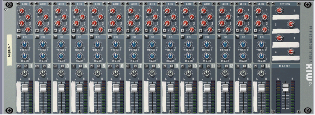
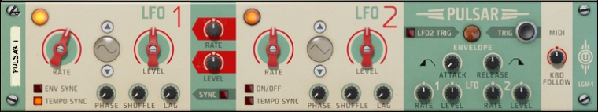
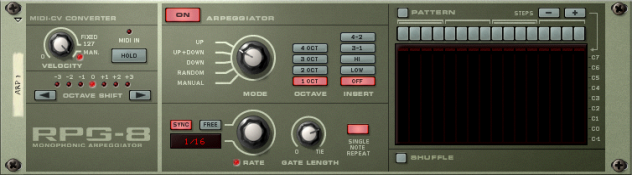
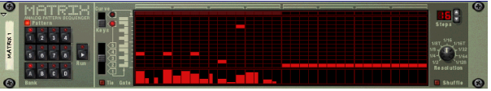
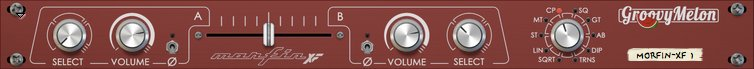

# Utilities mapping

* [Combinator](#mapping-with-the-combinator)
* [Mixer 14:2](#mapping-with-the-mixer-142)
* [Line Mixer 6:2](#mapping-with-the-line-mixer-62)
* [Pulsar Dual LFO](#mapping-with-the-pulsar-dual-lfo)
* [RPG-8 Monophonic Arpeggiator](#mapping-with-the-rpg-8-monophonic-arpeggiator)
* [Matrix Pattern Sequencer](#mapping-with-the-matrix-pattern-sequencer)
* [Morphin XF Crossfader](#mapping-with-the-morphin-xf-crossfader)
* [RPSpec Spectogram](#mapping-with-the-rpspec-spectogram)

## Mapping with the Combinator

The 1 line of the Arturia Keyboad LCD should display "Combinator" and the second one the name of the selected patch

| Arturia Keyboard surface | Reason Command | Comment |
| -------------------------- | -------------- | ----------------------- |
| Encoder 1 | Rotary 1 |  |
| Encoder 2 | Rotary 2 |  |
| Encoder 3 | Rotary 3 |  |
| Encoder 4 | Rotary 4 |  |
| Jog Wheel | Patch Selection | when "Preset" is selected |

## Mapping with the Mixer 14:2

The first line of the Arturia Keyboad LCD should display "Mixer 14:2" and  the second one "Ch1-8" or "Ch9-16" depending which variation is active.

| Arturia Keyboard surface | Reason Command | Comment |
| -------------------------- | -------------- | ----------------------- |
| Master fader | Master level|  |
| Master pan | Aux 1 Return Level |  |
| Fader <1-8> | Channel <1-8> Level | When "Ch1-8" variation is active |
| Encoder <1-8> | Channel <1-8> Pan | When "Ch1-8" variation is active |
| Fader <1-6> | Channel <9-14> Level | When "Ch9-14" variation is active |
| Encoder <1-6> | Channel <9-14> Pan | When "Ch9-14" variation is active |
| Part1 / Next| Keyboard Shortcut Variations | To select Channels 9 to 14 variation |
| Part2 / Prev| Keyboard Shortcut Variations | To select Channels 1 to 8 variation |

## Mapping with the Line Mixer 6:2

The first line of the Arturia Keyboad LCD should display "Line Mixer 6:2" and  the second one "Level&Pan" or "Aux" depending which variation is active.

| Arturia Keyboard surface | Reason Command | Comment |
| -------------------------- | -------------- | ----------------------- |
| Master fader | Master level|  |
| Master pan | Aux Return Level |  |
| Fader <1-6> | Channel <1-6> Level |  |
| Encoder <1-6> | Channel <1-6> Pan | When "Level&Pan" variation is active |
| Encoder <1-6> | Channel <1-6> Aux Send | When "Aux" variation is active |
| Part1 / Next| Keyboard Shortcut Variations | To select "Aux" variation |
| Part2 / Prev| Keyboard Shortcut Variations | To select "Level&Pan" variation |

## Mapping with the Pulsar Dual LFO

The first line of the Arturia Keyboad LCD should display "Pulsar".

| Arturia Keyboard surface | Reason Command | Comment |
| -------------------------- | -------------- | ----------------------- |
| Encoder 1 | LFO1 Rate Synced |  |
| Encoder 2 | LFO1 Level |  |
| Encoder 3 | LFO2 to LFO1 Rate |  |
| Encoder 4 | LFO2 to LFO1 Level|  |
| Encoder 5 | LFO2 Rate Free |  |
| Encoder 6 | LFO2 Level |  |
| Encoder 7 | Keyboard Track |  |

## Mapping with the RPG-8 Monophonic Arpeggiator

The first line of the Arturia Keyboad LCD should display "RPG8 Arpeggiator".

| Arturia Keyboard surface | Reason Command | Comment |
| -------------------------- | -------------- | ----------------------- |
| Encoder 1 | Velocity/Manual |  |
| Encoder 2 | Octave Shift |  |
| Encoder 3 | Mode |  |
| Encoder 4 | Octave |  |
| Encoder 5 | Insert |  |
| Encoder 6 | Rate |  |
| Encoder 7 | Gate Length|  |

## Mapping with the Matrix Pattern Sequencer

The first line of the Arturia Keyboad LCD should display "Matrix" and the second line the bank & the pattern active

| Arturia Keyboard surface | Reason Command | Comment |
| -------------------------- | -------------- | ----------------------- |
| Encoder 1 | Resolution |  |
| Jog Wheel | Banck / Pattern selection | when "Preset" is selected |

## Mapping with the Morphin XF Crossfader

The first line of the Arturia Keyboad LCD should display "Groovy Melon" and the second one "MorfinXF".

| Arturia Keyboard surface | Reason Command | Comment |
| -------------------------- | -------------- | ----------------------- |
| Encoder 1 | Ch A Select Input |  |
| Encoder 2 | Volume A |  |
| Encoder 3 | Crossfader |  |
| Encoder 4 | Volume B |  |
| Encoder 5 | Ch B Select Input |  |
| Encoder 6 | Curve Type |  |

## Mapping with the RPSpec Spectogram

The first line of the Arturia Keyboad LCD should display "Rob papen" and the second one "RBSpec Spectogram".

| Arturia Keyboard surface | Reason Command | Comment |
| -------------------------- | -------------- | ----------------------- |
| Encoder 1 | Spectogram Mode |  |
| Encoder 2 | Boost |  |
| Encoder 3 | Hold |  |
| Encoder 4 | Release |  |
