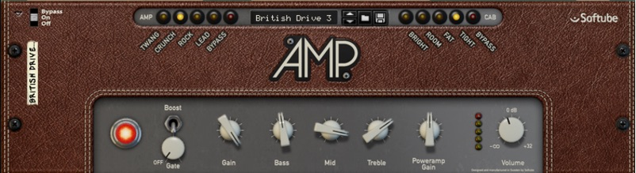
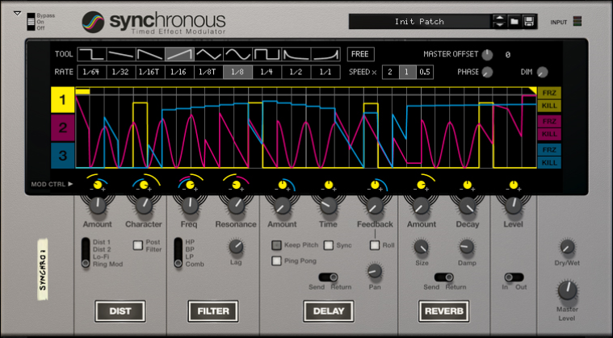
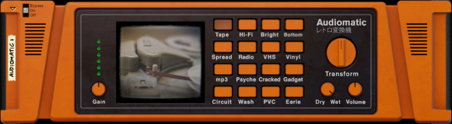
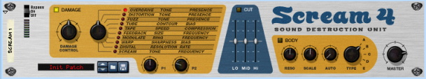

# Effects mapping

## Mapping with the Alligator

The first line of the Arturia Keyboad LCD should display "Alligator" and the second one, the name of the selected patch or the active filter depending which variation is active.

| Arturia Keyboard surface | Reason Command | Comment |
| -------------------------- | -------------- | ----------------------- |
| Master Fader | Master level |  |
| Fader 1 | Amp Env Attack | When main variation is active |
| Fader 2 | Amp Env Decay | When main variation is active |
| Fader 3 | Amp Env Release | When main variation is active |
| Fader 5 | Filter Env Attack | When main variation is active |
| Fader 6 | Filter Env Decay | When main variation is active |
| Fader 7 | Filter Env Release | When main variation is active |
| Encoder 1 | High Pass LFO Amount | When "High Pass filter" variation is active |
| Encoder 2 | High Pass Frequency | When "High Pass filter" variation is active |
| Encoder 3 | High Pass Resonance | When "High Pass filter" variation is active |
| Encoder 4 | High Pass Env Amount | When "High Pass filter" variation is active |
| Encoder 5 | High Pass Drive Amount | When "High Pass filter" variation is active |
| Encoder 6 | High Pass Phaser Amount | When "High Pass filter" variation is active |
| Encoder 7 | High Pass Delay Amount | When "High Pass filter" variation is active |
| Encoder 8 | High Pass Pan | When "High Pass filter" variation is active |
| Master Pan | High Pass Volume | When "High Pass filter" variation is active |
| Encoder 1 | Band Pass LFO Amount | When "Band Pass filter" variation is active |
| Encoder 2 | Band Pass Frequency | When "Band Pass filter" variation is active |
| Encoder 3 | Band Pass Resonance | When "Band Pass filter" variation is active |
| Encoder 4 | Band Pass Env Amount | When "Band Pass filter" variation is active |
| Encoder 5 | Band Pass Drive Amount | When "Band Pass filter" variation is active |
| Encoder 6 | Band Pass Phaser Amount | When "Band Pass filter" variation is active |
| Encoder 7 | Band Pass Delay Amount | When "Band Pass filter" variation is active |
| Encoder 8 | Band Pass Pan | When "Band Pass filter" variation is active |
| Master Pan | Band Pass Volume | When "Band Pass filter" variation is active |
| Encoder 1 | Low Pass LFO Amount | When "Low Pass filter" variation is active |
| Encoder 2 | Low Pass Frequency | When "Low Pass filter" variation is active |
| Encoder 3 | Low Pass Resonance | When "Low Pass filter" variation is active |
| Encoder 4 | Low Pass Env Amount | When "Low Pass filter" variation is active |
| Encoder 5 | Low Pass Drive Amount | When "Low Pass filter" variation is active |
| Encoder 6 | Low Pass Phaser Amount | When "Low Pass filter" variation is active |
| Encoder 7 | Low Pass Delay Amount | When "Low Pass filter" variation is active |
| Encoder 8 | Low Pass Pan | When "Low Pass filter" variation is active |
| Master Pan | Low Pass Volume | When "Low Pass filter" variation is active |
| Part1 / Next| Keyboard Shortcut Variations | To switch between "main", "High Pass Filter", "Band Pass Filter" & "Low Pass Filter" variations |
| Part2 / Prev| Keyboard Shortcut Variations | To switch between "main", "High Pass Filter", "Band Pass Filter" & "Low Pass Filter" variations |
| Jog Wheel | Select Previous/Next Preset | when "Preset" is selected |

## Mapping with The Echo

The first line of the Arturia Keyboad LCD should display "The Echo" and the second one, the name of the selected patch.

| Arturia Keyboard surface | Reason Command | Comment |
| -------------------------- | -------------- | ----------------------- |
| Master Fader | Ducking |  |
| Master Pan | Dry/Wet Balance |  |
| Encoder 1 | Delay Time |  |
| Encoder 2 | Right Ch Time Offset |  |
| Encoder 3 | Feedback |  |
| Encoder 4 | Right Ch Feedback Offset |  |
| Encoder 5 | Drive Amount |  |
| Encoder 6 | Drive Type |  |
| Encoder 7 | Envelope |  |
| Encoder 8 | Wobble |  |
| Fader 1 | Ping-Pong Mode |  |
| Fader 2 | Ping-Pong Pan |  |
| Fader 3 | Diffuse Spread |  |
| Fader 4 | Diffuse Amount |  |
| Fader 5 | Filter Frequency |  |
| Fader 6 | Filter Resonance |  |
| Fader 7 | LFO Rate |  |
| Fader 8 | LFO Amount |  |
| Jog Wheel | Select Previous/Next Preset | when "Preset" is selected |

## Mapping with the Pulveriser

The first line of the Arturia Keyboad LCD should display "Pulveriser" and the second one, the name of the selected patch.

| Arturia Keyboard surface | Reason Command | Comment |
| -------------------------- | -------------- | ----------------------- |
| Master Fader | Blend |  |
| Master Pan | Volume |  |
| Encoder 1 | Squash |  |
| Encoder 2 | Dirt |  |
| Encoder 3 | Filter Mode |  |
| Encoder 4 | Tremor to Frequency |  |
| Encoder 5 | Follower to Rate |  |
| Encoder 6 | Tremor Rate |  |
| Encoder 7 | Tremor Lag |  |
| Encoder 8 | Tremor to Volume |  |
| Fader 1 | Release |  |
| Fader 2 | Tone |  |
| Fader 3 | Filter Frequency |  |
| Fader 4 | Peak |  |
| Fader 5 | Follower to Frequency |  |
| Fader 6 | Follower Threshold |  |
| Fader 7 | Follower Attack |  |
| Fader 8 | Follower Release |  |
| Jog Wheel | Select Previous/Next Preset | when "Preset" is selected |

## Mapping with the Softube BassAmp

The first line of the Arturia Keyboad LCD should display "BassAmp" and the second one, the name of the selected patch.

| Arturia Keyboard surface | Reason Command | Comment |
| -------------------------- | -------------- | ----------------------- |
| Master Fader | Volume |  |
| Encoder 1 | Drive |  |
| Encoder 2 | Bass |  |
| Encoder 3 | Middle |  |
| Encoder 4 | Mid Freq |  |
| Encoder 5 | Treble|  |
| Fader 1 | Amp Switch |  |
| Fader 2 | Cab Switch |  |
| Jog Wheel | Select Previous/Next Preset | when "Preset" is selected |

## Mapping with the Softube Amp

The first line of the Arturia Keyboad LCD should display "Softube Amp" and the second one, the name of the selected patch.

| Arturia Keyboard surface | Reason Command | Comment |
| -------------------------- | -------------- | ----------------------- |
| Master Fader | Volume |  |
| Encoder 1 | Gate |  |
| Encoder 2 | Gain |  |
| Encoder 3 | Bass |  |
| Encoder 4 | Mid |  |
| Encoder 5 | Treble |  |
| Encoder 6 | Poweramp Gain |  |
| Fader 1 | Amp Switch |  |
| Fader 2 | Cab Switch |  |
| Jog Wheel | Select Previous/Next Preset | when "Preset" is selected |

## Mapping with the Synchronous Timed Effect Modulator

The first line of the Arturia Keyboad LCD should display "Synchronous" and the second one, the name of the selected patch.

| Arturia Keyboard surface | Reason Command | Comment |
| -------------------------- | -------------- | ----------------------- |
| Master Fader | Master level |  |
| Master Pan | Dry/Wet |  |
| Encoder 1 | Dist Amount |  |
| Encoder 2 | Dist Character |  |
| Encoder 3 | Filter Freq |  |
| Encoder 4 | Filter Reso |  |
| Encoder 5 | Delay  Amount |  |
| Encoder 6 | Delay Feedback |  |
| Encoder 7 | Reverb Amount |  |
| Encoder 8 | Reverb Decay |  |
| Fader 1 | Dist On/Off |  |
| Fader 2 | Filter On/Off |  |
| Fader 3 | Delay On/Off |  |
| Fader 4 | Reverb On/Off |  |
| Fader 8 | Level |  |
| Jog Wheel | Select Previous/Next Preset | when "Preset" is selected |

## Mapping with the Audiomatic Retro Transformer

The first line of the Arturia Keyboad LCD should display "Audiomatic" and the second one, the name of the selected patch.

| Arturia Keyboard surface | Reason Command | Comment |
| -------------------------- | -------------- | ----------------------- |
| Master Fader | Volume |  |
| Master Pan | Dry/Wet |  |
| Encoder 1 | Input Gain |  |
| Encoder 2 | Transform |  |
| Jog Wheel | Select Previous/Next Preset | when "Preset" is selected |

## Mapping with the Scream 4 Sound Destruction Unit

The first line of the Arturia Keyboad LCD should display "Scream 4" and the second one, the name of the selected patch.

| Arturia Keyboard surface | Reason Command | Comment |
| -------------------------- | -------------- | ----------------------- |
| Master Fader | Master level |  |
| Encoder 1 | Damage Control |  |
| Encoder 2 | Damage Type |  |
| Encoder 3 | Parameter 1 |  |
| Encoder 4 | Parameter 2 |  |
| Encoder 5 | Body Resonance |  |
| Encoder 6 | Body Scale |  |
| Encoder 7 | Body Auto |  |
| Encoder 8 | Body Type |  |
| Fader 1 | Cut Lo |  |
| Fader 2 | Cut Mid |  |
| Fader 3 | Cut Hi |  |
| Fader 6 | Damage On/Off |  |
| Fader 7 | Cut On/Off |  |
| Fader 8 | Body On/Off |  |
| Jog Wheel | Select Previous/Next Preset | when "Preset" is selected |

## Mapping with the BV512 Vocoder

The first line of the Arturia Keyboad LCD should display "BV512 Vocoder" and the second one, the range of active's bandes depending which variation is active.

| Arturia Keyboard surface | Reason Command | Comment |
| -------------------------- | -------------- | ----------------------- |
| Master pan | Dry/Wet |  |
| Encoder 1 | Band Count |  |
| Encoder 2 | Vocoder/Equalizer |  |
| Encoder 3 | Attack |  |
| Encoder 4 | Decay |  |
| Encoder 5 | Shift |  |
| Encoder 6 | HF Emphasis |  |
| Fader <1-8> | Bande Level <1-8> | When "Band Lv 1-8" variation is active |
| Fader <1-8> | Bande Level <9-16> | When "Band Lv 9-16" variation is active |
| Fader <1-8> | Bande Level <17-24> | When "Band Lv 17-24" variation is active |
| Fader <1-8> | Bande Level <25-32> | When "Band Lv 25-32" variation is active |
| Part1 / Next| Keyboard Shortcut Variations | To switch between "Band Lv 1-8", "Band Lv 9-16", "Band Lv 17-24" & "Band Lv 25-32" variations |
| Part2 / Prev| Keyboard Shortcut Variations | To switch between "Band Lv 1-8", "Band Lv 9-16", "Band Lv 17-24" & "Band Lv 25-32" variations |

## Mapping with the Neptune Pitch Adjuster and Voice Synth

The first line of the Arturia Keyboad LCD should display "Neptune" and the second one, the target note name.

| Arturia Keyboard surface | Reason Command | Comment |
| -------------------------- | -------------- | ----------------------- |
| Encoder 1 | Pitch Bend Range |  |
| Encoder 2 | Vibrato Rate |  |
| Encoder 3 | Catch Zone |  |
| Encoder 4 | Cent |  |
| Encoder 5 | Semitones |  |
| Encoder 6 | Formant Shift |  |
| Fader 1 | Correction Speed |  |
| Fader 2 | Preserve Expression |  |
| Fader 3 | Pitched Signal Level |  |
| Fader 4 | Voice Synth Level |  |
